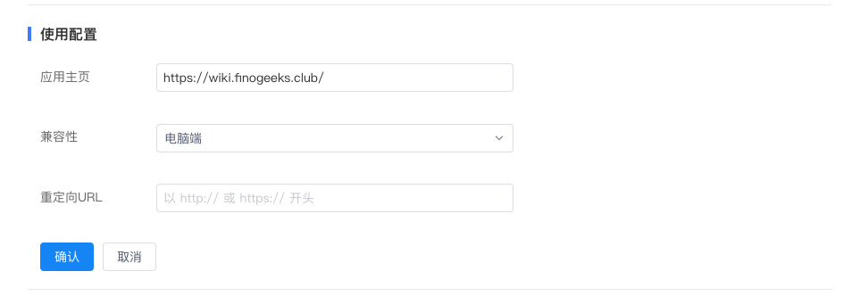

# 网页应用开发指南
## 概述
如果机构已有网页形式的应用，或新应用涉及的业务场景比较庞大，可以选择以网页应用的形式开发和上架应用，从而实现业务与沟通场景的相结合。

## 开发指南
网页应用的创建、上架和测试流程可以查看[应用开发与管理流程](https://docs.finogeeks.club/docs/finchat/#/finstore?id=%E8%87%AA%E5%BB%BA%E5%BA%94%E7%94%A8%E6%B5%81%E7%A8%8B)，本章节主要介绍网页应用特有能力的配置与实现。

### 1.主页配置
在应用详情页，配置应用主页地址；如果网页应用仅适配了桌面端，则将“兼容性”设为“桌面端”，移动端同理。

### 2.接入登录系统
网页应用接入FinChat登录后即可实现客户端内免登录打开应用。

FinChat支持两种客户端内应用登录方案，方案一是FinChat和网页应用都作为某个IAM的客户，网页应用所需的登录信息由FinChat共享给应用，方案二是FinChat作为IAM，网页应用所需的登录信息由FinChat授权给应用。方案一具体内容可以查看[身份认证](https://docs.finogeeks.club/docs/finchat/api/api_server.html#%E8%BA%AB%E4%BB%BD%E8%AE%A4%E8%AF%81)，方案二即将上线。

接入FinChat登录系统前，需先在应用详情页配置重定向URL。

### 3.接入JS-SDK
网页应用可以通过接入FinChat JS-SDK，调用客户端内的相关能力，如唤起联系人组件、转发组件等，具体可以查看[FinChat JS-SDK](https://docs.finogeeks.club/docs/finchat/api/api_client.html#%E6%A6%82%E8%BF%B0)

### 4.实现快捷搜索
快捷搜索，是指将应用内的搜索功能抽离出来，与FinChat内的搜索框相结合，免去用户打开应用再搜索的麻烦，更好地将应用融入到聊天场景中。

1.配置快捷搜索

在应用详情-快捷搜索页面，开启后，分别填写：
* 搜索回调URL：应用市场会将搜索词和搜索用户id推送给此URL
* shortcut token：可任意填写或采用应用市场自动生成的，用于校验回调请求的合法性

2.调整返回格式

应用须按照特定格式返回，具体可以查看[快捷搜索](https://docs.finogeeks.club/docs/finchat/api/api_server.html#%E5%9B%9E%E8%B0%83%E6%8E%A5%E5%8F%A3-2)。

最终效果如下图：

### 5.消息互通
每个网页应用可以启用一个机器人，通过机器人替代应用将消息即时通知到用户，从而打破应用与用户间的壁垒。机器人开发具体可以查看[机器人开发指南](https://docs.finogeeks.club/docs/finchat/backend/bot.html#%E6%A6%82%E8%BF%B0)

