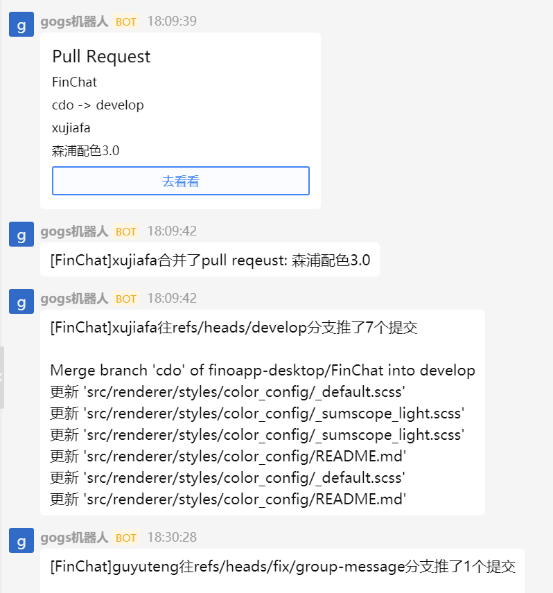
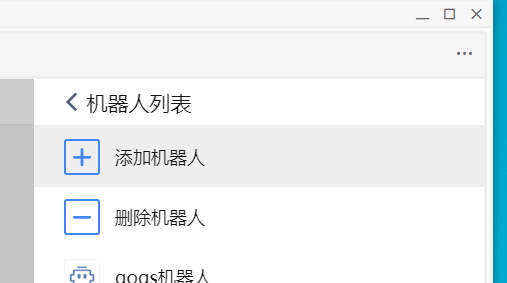
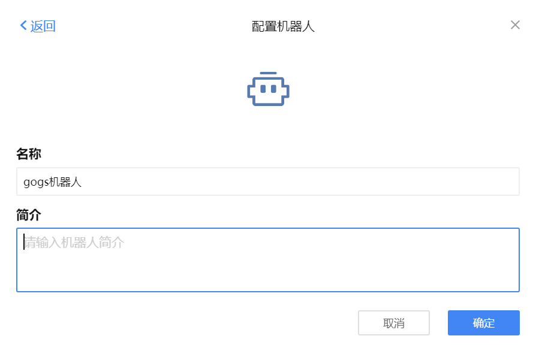
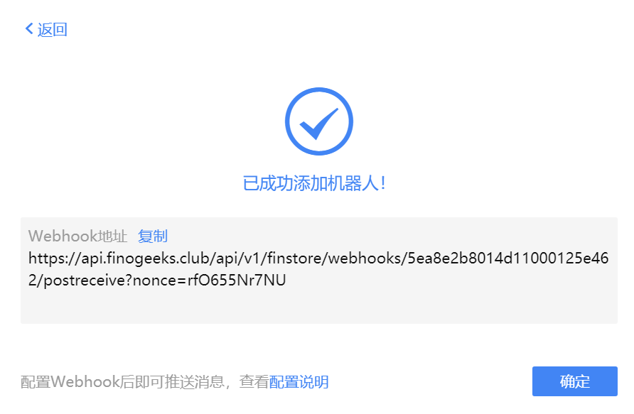
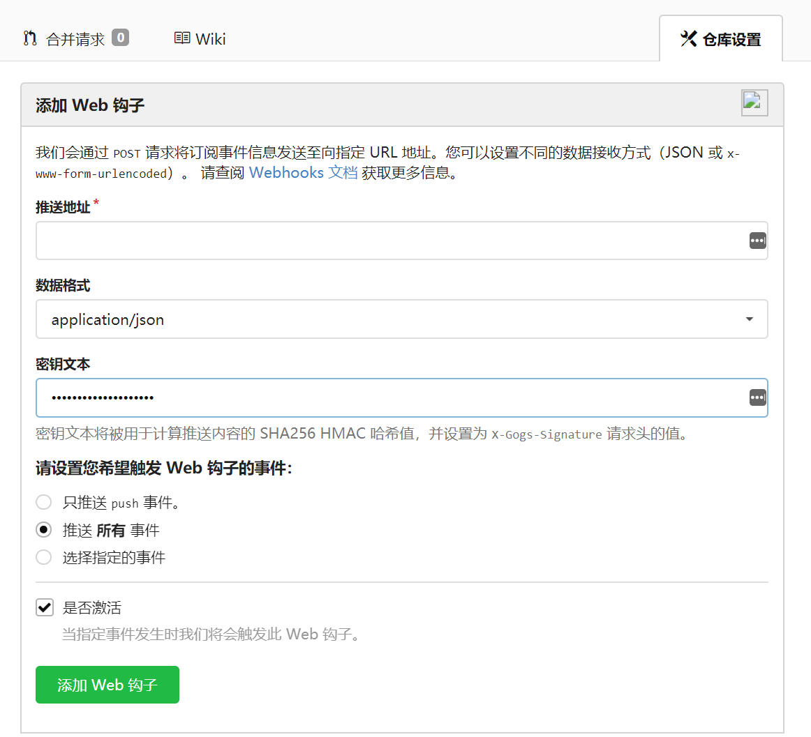
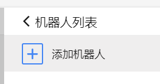
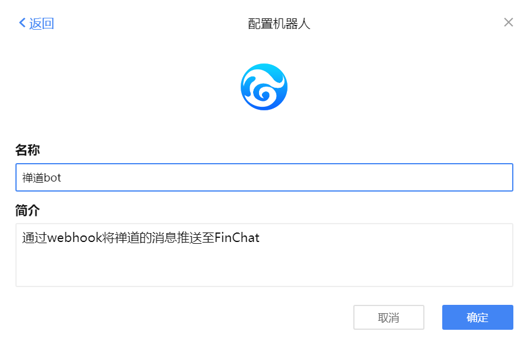
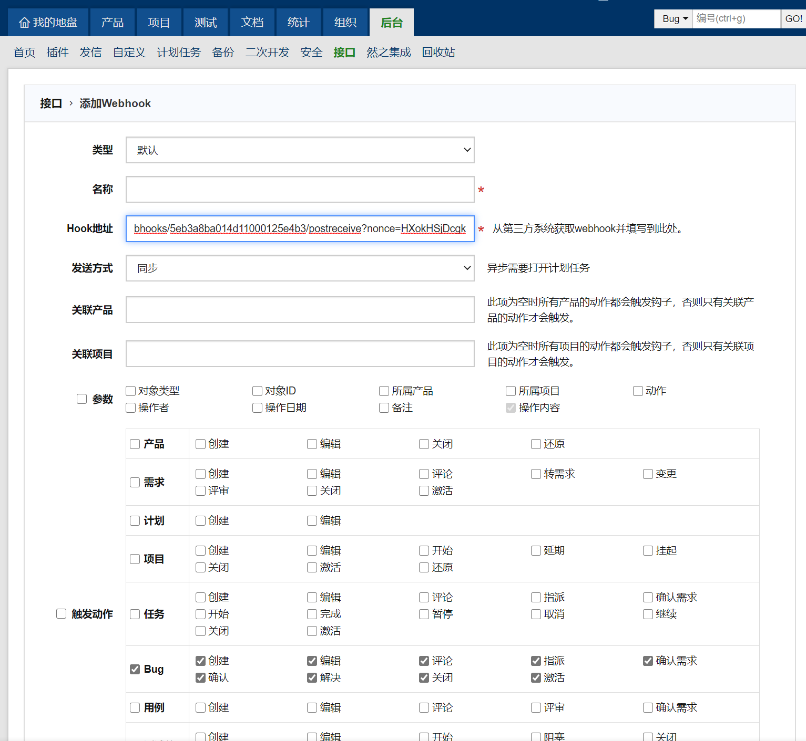

# Webhook机器人

## Gogs机器人

Gogs机器人利用gogs的Web钩子功能，将对应项目的git操作信息（如commit、pull request等）由机器人发送的群或频道内，辅助整个开发流程，效果如下图所示：

#### 配置步骤

1. 在群设置界面的“机器人”一栏点击“添加机器人”

2. 选择“gogs机器人”，并输入自定义名称和简介

3. 复制机器人的Webhook地址

4. 将Webhook地址填入gogs仓库的Web钩子处

## 禅道机器人

#### 配置步骤

1. 在群设置界面的“机器人”一栏点击“添加机器人”

2. 选择“gogs机器人”，并输入自定义名称和简介

3. 复制机器人的Webhook地址

4. 将Webhook地址填入禅道的Webhook

