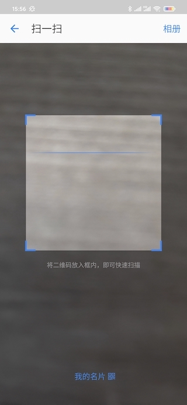

## 集成步骤

#### 1. Android SDK 介绍及导入

* 去[凡泰官网](https://www.finogeeks.com/) (https://www.finogeeks.com/) 申请注册凡泰极客开发者账号
* 申请 __AppId__ 和 __AppKey__，详细请咨询相关接口人。(如果是试用，可以使用[官方demo工程](https://git.finogeeks.com/finchat/finchat-android-demo)中的appid和appkey)

##### 1.1 Android SDK 介绍
__FinChat SDK__ 为用户开发 IM 应用提供完善的功能框架。本SDK最低支持Android 4.4(API19)，最高支持Android Q，通过Gradle的方式引入依赖。

架构图如下： 


* SDK_Core: 核心消息协议实现，完成与服务器之间的信息交换。
* SDK: 基于核心协议实现完整的 IM 功能，实现消息收发、会话管理、群组创建、好友增删等功能。
* HttpEngine: HTML5资源加速服务组件
* ConvoUI: 会话型UI交互组件
* FinoChatClient: 使用SDK接口的入口：负责完成初始化，也是获取功能模块的入口。
* AccountApi: 提供账户管理相关功能，包括登入、登出等。
* ContacApi: 提供好友的添加删除，黑名单的管理。
* GroupApi: 提供群组的管理，创建、删除群组，管理群组成员等功能。
* ChatRoomApi: 提供聊天室的管理。
* ChatUI: “消息聊天”用户交互界面
* ConversationUI: “会话”列表用户交互界面
* MineUI: “我的”用户交互界面
* ContactUI: “通讯录”用户交互界面

#### 2. 集成 Android SDK

在您阅读此文档时，我们假定您已具备基础的Android开发经验，并能够理解基础技术概念。

##### 2.1 通过Demo直接体验

您可以到凡泰极客官方git平台下载Demo工程 [finchat-android-demo](https://git.finogeeks.com/finchat/finchat-android-demo)。

##### 2.2 为现有工程集成FinChatSDK

若您有已上线应用，并希望在现有代码上集成FinChatSDK，请看下文具体配置步骤。

#### 3. 配置工程
##### 3.1 配置仓库地址
在项目顶层 __build.gradle__ 配置:

```
allprojects {
    repositories {
        google()
        jcenter()

        // 添加以下依赖源
        maven { url "https://jitpack.io" }
        maven {
            url "https://gradle.finogeeks.club/repository/finogeeks/"
            credentials {
                username "gradle"
                password "ftjk@@123321"
            }
        }
        maven { url "https://dl.bintray.com/drummer-aidan/maven" }
        maven { url "https://dl.bintray.com/thelasterstar/maven/" }
    }
}
```
##### 3.2 添加依赖库

然后通过项目模块 __build.gradle__ 添加依赖并编译工程：

```
dependencies {
     ......
   
    // 指定具体版本号或使用"latest.release"
    implementation "com.finogeeks.finochat.sdk:finochat-android-sdk:latest.release"

    // 音视频模块为可选配置，根据功能需求选择性添加
    // 指定具体版本号或使用"latest.release"
    implementation "com.finogeeks.finochat.sdk:finovideochat:latest.release"

    // FinChatSDK方法引用超过64K，必须依赖multidex
    implementation 'androidx.multidex:multidex:2.0.1'
}
```

在项目模块 __build.gradle(Module:app)__ 的 __android__ 层级增加若干配置，如下

```
android {
    compileSdkVersion 29
    buildToolsVersion "29.0.2"
 


    defaultConfig {
        applicationId "com.finogeeks.finochatapp"
        targetSdkVersion 29

        // 最低支持版本19
        minSdkVersion 19

        // useSupportLibrary开启
        vectorDrawables.useSupportLibrary = true
        
        // 指定ABI
        ndk { abiFilters "armeabi", "x86", "armeabi-v7a" }
        
        // 为Android5.0及以上开启内置MultiDex
        defaultConfig { multiDexEnabled true }
    }

    ......

    // 增加以下配置
    compileOptions {
        sourceCompatibility JavaVersion.VERSION_1_8
        targetCompatibility JavaVersion.VERSION_1_8
    }

      packagingOptions {
          doNotStrip '*/mips/*.so'
          doNotStrip '*/mips64/*.so'

          // The project react-native does not provide 64-bit binaries at the
          // time of this writing. Unfortunately, packaging any 64-bit
          // binaries into the .apk will crash the app at runtime on 64-bit
          // platforms.
          exclude '/lib/mips64/**'
          exclude '/lib/arm64-v8a/**'
          exclude '/lib/x86_64/**'
          pickFirst '/lib/x86/libjsc.so'
          pickFirst '/lib/armeabi-v7a/libjsc.so'
          exclude 'META-INF/proguard/androidx-annotations.pro'
      }
}
```

##### 3.3 配置权限

在 __AndroidManifest.xml__ 为SDK运行配置必要权限：

```xml
<uses-permission android:name="android.permission.READ_PHONE_STATE" />
<uses-permission android:name="android.permission.ACCESS_NETWORK_STATE" />
<uses-permission android:name="android.permission.ACCESS_WIFI_STATE" />
<uses-permission android:name="android.permission.INTERNET" />
```

#### 4. Android SDK使用

接口文档请参考链接：[APIDoc](https://docs.finogeeks.club/docs/android/index.html)

##### 4.1 创建配置选项
要求在 __Application__ 的 __onCreate()__ 方法中进行初始化。初始化依赖传入 __FinoChatOption__ 对象实例获取SDK运行过程中的必要参数。

注意：Application父类必须继承 __MultiDexApplication__ 

```java
public class XApplication extends MultiDexApplication {

    private static final String TAG = "XApplication";

    @Override
    public void onCreate() {
        super.onCreate();

        // 转发消息到微信、QQ、微博、微信小程序，需要设置外部SDK的Key
        // 若对应外部模块不需要则无须设置
        FinoChatOption.ShareParams params = new FinoChatOption.ShareParams();
        params.wechatAppId = ".....";
        params.qqAppId = ".....";
        params.weiBoAppKey = ".....";
        params.miniProgramId = ".....";
        params.appletAvatar = R.drawable.app_icon;

        FinoChatOption option = new FinoChatOption();
        option.setApiURL("https://api.finogeeks.club"); // 服务器地址
        option.setAppKey("AppKey");
        option.setAppType("STAFF");
        option.setAppId("3");
        option.setApiPrefix("/api/v1");
        option.getNotification().notificationIcon = R.drawable.app_icon;
        option.setAppDebug(BuildConfig.DEBUG);
        option.setLogLevel(android.util.Log.VERBOSE);
        option.setSdkVersion(com.finogeeks.finochat.BuildConfig.VERSION_NAME);
        option.setShareParams(params);

        // 同步初始化
        FinoChatClient.getInstance().initFinoChatSession(this, option, new FinoCallBack() {
            @Override
            public void onProgress(int i, String s) {
            }

            @Override
            public void onSuccess(Object o) {
                Log.i(TAG, "initFinoChatSession() is Success.");
            }

            @Override
            public void onError(int i, String s) {
                Log.e(TAG, "initFinoChatSession.onError(), code:" + i + ",message:" + s);
            }
        });
    }
}
```


##### 4.2 检查登录状态

在 __Application__ 完成初始化后，可在 __SplashActivity__ 检查用户是否已经登录，并执行不同逻辑，如下示例：

```java
class SplashActivity : AppCompatActivity() {
    override fun onCreate(savedInstanceState: Bundle?) {
        super.onCreate(savedInstanceState)
        setContentView(R.layout.activity_main)

        if (FinoChatClient.getInstance().accountManager().isLogin) {
            startActivity(Intent(this, HomeActivity::class.java)) // 进入主页使用FinChatSDK
        } else {
            startActivity(Intent(this, LoginActivity::class.java)) // 进入用户账户登录界面
        }
    }
}
```

##### 4.3 用户登录

用户登录界面，使用以下接口登录FinChatSDK

```java
FinoChatClient.getInstance().accountManager().login(username, password, new FinoCallBack<Map<String, Object>>() {
    @Override
    public void onSuccess(Map<String, Object> result) {
        startActivity(new Intent(LoginActivity.this, SplashActivity.class));
        finish();
    }
    @Override
    public void onProgress(int progress, String status) {
        finish();
    }
    @Override
    public void onError(int code, String message) {
        Log.d("LoginActivity", message);
        Toast.makeText(LoginActivity.this, message, Toast.LENGTH_LONG).show();
    }
});
```
登录成功后会自动初始化session，同时sdk还会提供有token的登录接口。

#### 5. 主页面搭建
为了提供灵活的页面配置，sdk没有提供默认主页面，而是提供了对应的Fragment供用户自由组装，其中包括“会话“页面、”通讯录“页面和”我的“页面。

开发者可以通过以下代码获取页面Fragment：

> FinoChatClient.getInstance().chatUIManager().conversationFragment();

例如以下示例：

```java
public class HomeActivity extends AppCompatActivity {
    @Override
    protected void onCreate(@Nullable Bundle savedInstanceState) {
        super.onCreate(savedInstanceState);
        setContentView(R.layout.activity_home);
        Fragment f = FinoChatClient.getInstance().chatUIManager().conversationFragment();
        getSupportFragmentManager().beginTransaction()
                .add(R.id.container, f)
                .commit();
    }
}
```

对应页面布局：

```xml
<FrameLayout xmlns:android="http://schemas.android.com/apk/res/android"
    android:layout_width="match_parent"
    android:layout_height="match_parent"
    android:orientation="vertical">

    <FrameLayout
        android:id="@+id/container"
        android:layout_width="match_parent"
        android:layout_height="match_parent"
        android:background="@android:color/white" />
</FrameLayout>
```

#### 6. 主要API接口
sdk对外暴露的API接口主要在com.finogeeks.finochat.sdk包中：

- FinoChatClient :客户端主要入口，提供初始化接口和获取其他服务；
- IAccountManager：账户相关接口，包括登录 注销 登录状态判断等；
- IChatUiManager：UI相关接口，用户获取一些Fragment以及启动一些页面或对话框；
- IChatRoomManager：包含房间消息相关api
- IBadgeManager：通知角标管理相关api
- INotificationManager：sdk事件通知接口，可以用于监听sdk内部事件 如退出登录然后执行自己的操作；
- IPluginManager ： 一些UI定制的接口 例如可以在聊天页面更多菜单里注册自己的选项并获取事件监听 也可以定制我的页面的项目；

以上接口的获取方式示例 ：FinoChatClient.getInstance().accountManager()

#### 7. 主题配置示例
1.在styles.xml里自定义主题

```xml
<style name="Theme_ICBC_GOLD">
    <item name="TP_color_normal">#A6844F</item> // 主题色普通态
    <item name="TP_color_pressed">#584529</item> // 主题色点击态
    <item name="TP_color_disable">#D2C1A7</item> // 主题色不可点击态

    <item name="Bubble_Host_solid_color">#FFF5E7</item> // 本人消息气泡填充
    <item name="Bubble_Host_stroke_color">#E4DACA</item> // 本人消息气泡描边

    <item name="Bubble_Guest_solid_color">#FFFFFF</item> // 对方消息气泡填充
    <item name="Bubble_Guest_stroke_color">#CFCFCF</item> // 对方消息气泡描边

    <item name="button_solid_normal">#A6844F</item> // 按钮普通态填充
    <item name="button_solid_pressed">#584529</item> // 按钮点击态填充
    <item name="button_solid_disable">#D2C1A7</item> // 按钮不可点击填充

    <item name="NAV_color">#FAFAFA</item> // Toolbar背景色
    <item name="NAV_TP_color_normal">#A6844F</item> // Toolbar切图，文字普通（包含调用系统的返回箭头）
    <item name="NAV_TP_color_pressed">#584529</item> // Toolbar切图，文字点击（包含调用系统的返回箭头）
    <item name="NAV_TP_color_disable">#D2C1A7</item> // Toolbar切图，文字不可点击（包含调用系统的返回箭头）
    <item name="NAV_title_color">#333333</item> // Toolbar标题文字颜色
    <item name="NAV_line">#B0B0B0</item> //Toolbar分割线颜色

    <item name="switch_solid_enable_off">#FFFFFF</item> // 开关可操作_关闭
    <item name="switch_solid_enable_on">#A6844F</item> // 开关可操作_打开
    <item name="switch_solid_disable_off">#FFFFFF</item> // 开关不可操作_关闭
    <item name="switch_solid_disable_on">#D2C1A7</item> // 开关不可操作_打开

    <item name="Primary_color">?attr/TP_color_normal</item> // 主题色
    <item name="Primary_dark_color">?attr/NAV_color</item> // 状态栏颜色
    <item name="Accent_color">?attr/TP_color_normal</item> // 主题高亮色
    <item name="NavigationBarColor">@color/white</item> // 虚拟导航栏颜色
</style>
```

2.代码配置

__Application.onCreate()__ 初始化过程中注入主题：

```
Map themeMap = new LinkedHashMap();
themeMap.put("热情红", R.style.Theme_Red);
themeMap.put("高雅金", R.style.Theme_GOLD);
options.setThemeMap(themeMap); 
```

#### 8. 其他配置

##### 混淆配置

FinChatSDK内部已经进行过代码混淆，只需在混淆配置中保持finchat的类不被混淆就可以了

```
-keep class com.finogeeks.** {*;}
```

##### 地图配置

sdk位置功能使用了高德地图sdk，开发者需要申请高德地图sdk方可使用

在manifest文件中加入以下配置

```xml
<meta-data
            android:name="com.amap.api.v2.apikey"
            android:value="${amap_api_key}" />
```

##### 外部分享配置

sdk可以接受外部分享的图片，视频等媒体文件，也可以接受打开指定scheme的链接

在gradle config中加入以下内容，或者在应用中放入对应名称的资源

配置sdk支持的scheme：

    resValue "string", "app_scheme", "finchat"

配置接收分享时在系统分享中显示的icon：

    resValue "drawable", "app_icon", "@drawable/logo_r"

#### 9. 疑难解答

##### 错误1：MultiDex错误

构建过程出现以下错误：

> Cannot fit requested classes in a single dex file (# methods: 167850 > 65536 ; # fields: 207046 > 65536)

原因：没有开启 __MultiDex__ 编译声明，在 __build.gradle(Module:app)__ 开启：

解决方案：

```
android {
    compileSdkVersion 29
    defaultConfig {
        applicationId "com.finogeeks.finochatapp"
        multiDexEnabled true // 开启声明
        ....
}
```

##### 错误2

> java.lang.UnsatisfiedLinkError: dalvik.system.PathClassLoader[DexPathList[[zip file "/data/app/com.finogeeks.finchatsdk-09X2htoKGcUERLLIrRwNcQ==/base.apk"],nativeLibraryDirectories=[/data/app/com.finogeeks.finchatsdk-09X2htoKGcUERLLIrRwNcQ==/lib/arm64, /system/lib64, /system/product/lib64]]] couldn't find "libsdkcore.so"

原因：没有声明ABI时App使用错误ABI导致崩溃

解决方案：

```java
android {
    compileSdkVersion 29
    buildToolsVersion "29.0.2"
    defaultConfig {
        applicationId "com.finogeeks.finchatsdk"
        
        ndk { abiFilters "armeabi", "x86", "armeabi-v7a" } // 声明支持的ABI类型
    }
   .....
}
```

##### 错误3

报错：

```
Manifest merger failed : uses-sdk:minSdkVersion 17 cannot be smaller than version 19 declared in library [com.finogeeks.finochat.sdk:finochat-android-sdk:3.4.31]
```

解决方案：SDK支持最低 __minSdkVersion__ 为19，请自行修改gradle配置

## 架构介绍


FinChat SDK使用组件化的架构，充分解耦了各个模块。集成时可以根据需求选择一些可选模块，比如音视频模块。
sdk架构主要分三层，基础设施层包括matrixsdk负责底层即时通讯，FinApplet为小程序运行时，sdkcore负责权限校验。业务基础层主要为sdkcommon，负责sdk内部的基础业务逻辑。业务层主要就是各个模块的组件，实现了上层的业务功能。

#### 模块介绍

- matrixsdk

基础通讯模块，包含底层的即时通讯功能

- sdkcommon

sdk的基础模块，包含公共的工具库和资源，以及一些基础的功能

- FinoChatMessage

聊天模块，包含房间的创建，详情，消息搜索，聊天页面等功能

- FinoConversion

会话模块，主要包含会话列表相关功能

- FinoContacts

通讯录模块，主要包含通讯录，好友详情等

- FinoNetdisk

网盘模块，包含网盘的展示，搜索，文件转发等功能

- FinoSearch

搜索模块，包含全局搜索相关功能

- FinoWork

工作模块，包含任务，通知，待办等功能

- FinoShare

分享模块，包含外部分享，第三方分享相关功能

- FinoVideoChat

音视频模块，包含音视频通话相关功能

#### 源码集成

FinChatSDK的基本集成方式为提供统一的sdk开发包，开发者以sdk提供的接口为基础构建应用。FinChatSDK提供了众多UI层的开放接口，但是如果sdk提供的默认UI不满足需求时，FinChatSDK还支持以源码的方式集成sdk。

通过源码集成时开发者可以修改sdk内部的实现逻辑，从而实现复杂的定制功能。源码集成需要首先获得商务上的授权，然后凡泰会提供指定模块的源码给集成方。并不是所有的源码都是开放的，finchat只提供了一些组件层的源码，一些底层源码没有开放。

在拿到源码后，开发者可以方便的集成到自己的工程中。因为sdk使用组件化的架构，开发者一般不需要集成所有的源码。而只需要集成自己需要修改的模块。

首先将源码里的module添加到自己的工程中：


然后在dependencies中依赖导入的module

```
dependencies {
     ......
   implementation project(":sdkcommon")
}
```

因为只导入了一个模块，所以还需要正常依赖finchatsdk，但是需要把导入源码的模块exclude掉


```
dependencies {
     ......
   
    
    implementation ("com.finogeeks.finochat.sdk:finochat-android-sdk:latest.release"){
        exclude module : "sdkcommon"
    }

}
```

这样就完成了指定组件的源码集成，修改对应组件的源码即可实现内部UI的自定义


## 开发指南

### 基础功能

#### 初始化

sdk在使用前需要先初始化，建议在application onCreate中初始化sdk。

```java
    FinoChatOption option = new FinoChatOption();
    option.setApiURL("https://api.finogeeks.com"); // 服务器地址
    option.setAppKey("AppKey");
    option.setAppType("STAFF");
    option.setAppId("3");
    option.setApiPrefix("/api/v1");
    option.getNotification().notificationIcon = R.drawable.app_icon;
    option.setAppDebug(BuildConfig.DEBUG);
    option.setLogLevel(android.util.Log.VERBOSE);
    option.setSdkVersion(com.finogeeks.finochat.BuildConfig.VERSION_NAME);
    option.setShareParams(params);
    // 同步初始化
    FinoChatClient.getInstance().initFinoChatSession(this, option, new FinoCallBack() {
        @Override
        public void onProgress(int i, String s) {
        }

        @Override
        public void onSuccess(Object o) {
            Log.i(TAG, "initFinoChatSession() is Success.");
        }

        @Override
        public void onError(int i, String s) {
            Log.e(TAG, "initFinoChatSession.onError(), code:" + i + ",message:" + s);
        }
    });
```

FinoChatOption为初始化sdk时的一些配置信息，比如要连接的服务器地址等信息

FinoChatOption字段介绍

- apiURL api接口地址，对应后台服务的地址
- apiPrefix api前缀，固定值
- appKey sdk授权校验的key，appKey需要跟凡泰对接人员申请
- appId app标示，一般不需要修改
- appType 终端类型 RETAIL-客服端，STAFF-员工端
- allowedFingerprints 如果使用自定义的ssl证书，需要在此指定证书的指纹
- pin 是否使用固定的ssl证书
- isAppDebug 标识当前App工程是否处于DEBUG模式下 必须设置此选项
- sdkVersion 应用版本号 会在设置页面中展示
- logLevel 日志等级 参考android.util.Log.VERBOSE
- logTagPrefix 日志tag的前缀
- notification 应用前台通知配置，为了保持消息同步需要开启前台通知，该项可以关闭
- themeId 主题id
- themeMap 配置多个主题
- appConfigType 对应后台配置的configtype，默认mobile
- shareParams 第三方分享配置
- finoWebView sdk内部webview配置

sdk初始化主要对sdk内部一些变量，服务等进行初始化。同时，sdk会缓存用户登录信息，当用户已经登录时，初始化sdk会同时开启消息同步。当用户未登录时，初始化不会开启消息同步。此时需要调用登录接口，当登录成功后会开启消息同步。

#### sdk初始化监听

    FinoChatClient.getInstance().isSessionInitSuccess()

此方法会返回sdk是否初始化成功，包括已经从服务器同步到最新的消息

    FinoChatClient.getInstance().addSessionInitStatusObserver(observer)

此方法用于监听sdk的初始化状态，当初始化成功时会回调到observer里。有时候需要在sdk初始化成功后做一些事情，可以使用此方法。

使用示例：

在闪屏页判断sdk是否初始化完成：

```java
if (FinoChatClient.getInstance().isSessionInitSuccess()) {
    navigate2Home();
} else {
    new Handler().postDelayed(SplashActivity::navigate2Home, 2000);
}
```

在sdk初始化完成之后执行一些操作：

```java
FinoChatClient.getInstance().addSessionInitStatusObserver(new FinoCallBack<Void>() {
    @Override
    public void onSuccess(Void result) {
        PushService.init();
    }
    @Override
    public void onError(int code, String error) {
    }
    @Override
    public void onProgress(int status, String error) {
    }
});
```

### sdk主要api接口

sdk的主要入口为[FinoChatClient](https://docs.finogeeks.club/docs/android/classcom_1_1finogeeks_1_1finochat_1_1sdk_1_1_fino_chat_client.html)

可以通过 `FinoChatClient` 获取到sdk大部分开放的接口，例如 `FinoChatClient.getInstance().accountManager()`


#### accountManager()
账户管理相关api

#### chatUIManager()
界面管理相关api

#### pluginManager()
插件功能相关api

#### chatRoomManager()
房间管理相关api

#### getBadgeManager()
通知角标管理

#### getSessionManager()
session管理

#### getAppletManager()
小程序管理

#### getForwardManager()
转发接口

#### getSelectorService()
选择器接口

### 账户管理

账户管理接口为 [IAccountManager](https://docs.finogeeks.club/docs/android/interfacecom_1_1finogeeks_1_1finochat_1_1sdk_1_1_i_account_manager.html)

#### 用户登录

```java
void login(String username, String password, FinoCallBack finoCallBack)
```

参数介绍
- username 用户名
- password 密码

示例：

```kotlin
FinoChatClient.getInstance().accountManager().login(username, password, object : FinoCallBack<Map<String, Any>?> {
    override fun onSuccess(result: Map<String, Any>?) {
        runOnUiThread { loadingDialog.dismiss() }
    }
    override fun onProgress(progress: Int, status: String) {
        runOnUiThread {
            loadingDialog.dismiss()
            startActivity(Intent(this@LoginActivity, SplashActivity::class.java))
            finish()
        }
    }
    override fun onError(code: Int, message: String) {
        Log.d("LoginActivity", message)
        runOnUiThread {
            Toast.makeText(this@LoginActivity, message, Toast.LENGTH_LONG).show()
            loadingDialog.dismiss()
        }
    }
})
```

#### token登录

sdk支持使用token登录，token由后端生成

    void loginWithToken(String token, FinoCallBack finoCallBack)

示例：

```kotlin
FinoChatClient.getInstance().accountManager().loginWithToken(token, object : FinoCallBack<Map<String, Any>?> {
    override fun onSuccess(result: Map<String, Any>?) {
    }
    override fun onProgress(progress: Int, status: String) {
        startActivity(Intent(this@LoginActivity, SplashActivity::class.java))
        finish()
    }
    override fun onError(code: Int, message: String) {
        Log.d("LoginActivity", message)
        Toast.makeText(this@LoginActivity, message, Toast.LENGTH_LONG).show()
    }
})
```

#### 判断是否登录

    boolean isLogin()

示例：

```java
if (FinoChatClient.getInstance().accountManager().isLogin()) {
    SplashActivity.navigate2Home();
    return;
} else {
    SplashActivity.gotoLogin();
    return;
}
```

#### 获取登录用户的userId

    String loginUserId()

示例：

```java
CrashReport.setUserId(getApplicationContext(),
                FinoChatClient.getInstance().accountManager().loginUserId());
```
#### 退出登录

    void logout(FinoCallBack callback)

示例：

```java
FinoChatClient.getInstance().accountManager().logout(new FinoCallBack() {
    @Override
    public void onSuccess(Object result) {
        gotoLogin()
    }
    @Override
    public void onError(int code, String error) {
    }
    @Override
    public void onProgress(int status, String error) {
    }
});
```

#### 缓存管理

- 获取sdk缓存大小

```kotlin
    void getCacheSize(@NonNull Context context, @NonNull FinoCallBack<Long> callBack)
```

其中回调结果为sdk内缓存数据的大小，单位byte

示例：

```kotlin
FinoChatClient.getInstance().accountManager.getCacheSize(activity, object : SimpleCallBack<Long>() {
    override fun onSuccess(result: Long) {
        cacheSize.text = FileFormatter.formatFileSize(result)
    }
})
```

- 清理缓存

```kotlin
    void clearCacheSize(@NonNull Context context, @NonNull FinoCallBack<Void> callBack);
```

示例：

```kotlin
clearCache.setOnClickListener{
    FinoChatClient.getInstance().accountManager.clearCacheSize(activity, object : SimpleCallBack<Void?>() {

                override fun onSuccess(result: Void?) {
                    toast("清理成功")
                }

                override fun onError(code: Int, error: String?) {
                    toast("清理失败")
                }
            })
}
```

### 界面管理

界面相关接口为[IChatUIManager](https://docs.finogeeks.club/docs/android/interfacecom_1_1finogeeks_1_1finochat_1_1sdk_1_1_i_chat_u_i_manager.html)

#### 获取会话列表

```kotlin
    Fragment conversationFragment()
```

示例：

```java
Fragment fragment = FinoChatClient.getInstance().chatUIManager().conversationFragment();
getSupportFragmentManager().beginTransaction()
                .add(R.id.container, fragment)
                .commit();
```

#### 获取通讯录列表

    Fragment contactFragment()

示例：
```java
Fragment fragment = FinoChatClient.getInstance().chatUIManager().contactFragment();
getSupportFragmentManager().beginTransaction()
                .add(R.id.container, fragment)
                .commit();
```

#### 获取工作页面

    Fragment workFragment()

示例：
```java
Fragment fragment = FinoChatClient.getInstance().chatUIManager().workFragment();
getSupportFragmentManager().beginTransaction()
                .add(R.id.container, fragment)
                .commit();
```

#### 获取个人信息页面


Fragment mineFragment()


示例：

```java
Fragment fragment = FinoChatClient.getInstance().chatUIManager().conversationFragment();
getSupportFragmentManager().beginTransaction()
                .add(R.id.container, fragment)
                .commit();
```

#### 创建一个webview页面

    Fragment webViewFragment(String url)

示例：

```java
Fragment fragment = FinoChatClient.getInstance().chatUIManager().WebViewFragment("https://www.baidu.com");
getSupportFragmentManager().beginTransaction()
                .add(R.id.container, fragment)
                .commit();
```

#### 弹出添加好友/发起群聊的菜单

    void createHomeChatPopupWindow(@NonNull Activity activity, @IdRes int anchorId)

anchorId 弹窗位置的锚点

该方法为点击首页加号的操作，会弹出包括发起群聊，添加好友，创建频道，扫一扫的菜单


#### 打开创建群聊页面

    void createGroupChat(@NonNull Activity activity)

#### 打开创建频道页面

     void createChannel(@NonNull Activity activity)
    
#### 打开添加好友页面

    void addFriend(@NonNull Activity activity)

#### 打开搜索页面

    void startSearch(@NonNull Activity activity)

#### 打开个人网盘页面

    void startPrivateNetDisk(Context context, String name)


#### 打开二维码扫描页面

    void scanQrCode(Activity activity, boolean browseUrl)



扫描结果需要在onActivityResult中处理

```kotlin
override fun onActivityResult(requestCode: Int, resultCode: Int, data: Intent?) {
    super.onActivityResult(requestCode, resultCode, data)
    if (requestCode == IChatUIManager.REQUEST_CODE_SCAN_QR_CODE) {
        //处理扫描结果（在界面上显示）
        if (null != data) {
            val result = data.getStringExtra(IChatUIManager.SCAN_RESULT)
            if (result != null && result.isUrl()) {
                toast("识别成功")
                setUrl(result)
            }
        }
    }
}
```

#### 处理二维码扫描的结果

    void handleQrCodeScanResult(Context context, int requestCode, int resultCode, Intent data)

由finchatsdk来处理扫描结果

示例：

```kotlin
override fun onActivityResult(requestCode: Int, resultCode: Int, data: Intent?) {
    super.onActivityResult(requestCode, resultCode, data)
    FinoChatClient.getInstance().chatUIManager().handleQrCodeScanResult(this,requestCode,resultCode,data)
}
```

#### 在会话列表中，定位到下一个有未读消息的会话

    void locateToNextChatWithUnreadMessages(Fragment fragment)

该方法会滚动会话列表到下一个有未读消息的房间

#### 通过RoomId打开聊天房间

    void startRoomChat(Context activityContext, String roomId)

#### 打开房间 如果session正在初始化 会在初始化完成后打开

    void startRoomChatOnSessionInit(Context context, String roomId)

#### 通知会话列表的数据已经发生改变

    void notifyConversationDataChanged(Fragment fragment)

#### 加载应用抽屉视图控件

    void inflateAppsDrawerView(@NonNull DrawerLayout drawerLayout, @NonNull ViewGroup drawerViewContainer)


### 插件管理

插件管理接口为 [IPluginManager](https://docs.finogeeks.club/docs/android/interfacecom_1_1finogeeks_1_1finochat_1_1sdk_1_1_i_plugin_manager.html)

插件主要指在sdk内部一些列表或菜单中插入自定义的栏目，并且能在栏目被点击时接到通知，实现一些自定义的操作，例如房间加号菜单中的插件

#### 插件的字段 

[IPluginManager.MenuItem](https://docs.finogeeks.club/docs/android/classcom_1_1finogeeks_1_1finochat_1_1sdk_1_1_i_plugin_manager_1_1_menu_item.html)

- id 插件的id，自己定义，用于在接到回调时做区分
- name 插件的名称，一般会在界面上展示
- iconRes 插件对应的图标资源，比如房间加号的菜单，会展示对应的图标
- type  插件的类型  
MENU_TYPE_DEFAULT 默认类型  
MENU_TYPE_SINGLE_CHAT 单聊插件，只会在单聊房间展示  
MENU_TYPE_GROUP_CHAT 群聊插件，只会在群聊房间展示  

插件点击的监听器 [IPluginManager.MemuSelectListener](https://docs.finogeeks.club/docs/android/interfacecom_1_1finogeeks_1_1finochat_1_1sdk_1_1_i_plugin_manager_1_1_menu_select_listener.html)

当插件被点击时，回调方法会被执行

#### 房间加号菜单插件

注册房间加号菜单插件

    void registerRoomMenu(List<MenuItem> menuItems, MenuSelectListener listener)


房间插件是指在房间页面点击加号后出现的菜单选项入口。除了sdk固定的一些功能，还可以嵌入其他的功能入口，方便在聊天中完成其他的交互。

支持配置项: 菜单的icon名称和点击处理
调用方式:


```kotlin
val roomMenuItems = listOf(
        IPluginManager.MenuItem(1, "item1", R.drawable.input_add_photo),
        IPluginManager.MenuItem(1, "item2", R.drawable.input_add_photo)
)

FinoChatClient.getInstance().pluginManager.registerRoomExtMenu(roomMenuItems) { context, menuItemparams ->
    if (menuItem.id == 1) {
        context.toast("你点击了item1")
    }
}
```


#### 房间详情拓展菜单

房间详情的拓展菜单会显示在房间详情信息栏目的下面

注册房间详情拓展菜单

    void registerRoomDetailMenu(List<MenuItem> menuItems, MenuSelectListener listener)

示例

```kotlin
FinoChatClient.getInstance().pluginManager().registerRoomDetailMenu(
        listOf(IPluginManager.MenuItem(1, "投诉", 0))) { context, menuItem, map ->
    val roomId = map["roomId"]
    if (menuItem.id == 1)
        context.toast("你点击了投诉菜单,roomId:$roomId")
}
```
#### 个人详情拓展菜单

个人详情拓展菜单会在点击个人详情页的更多菜单时展示

注册个人详情拓展菜单

    void registerPersonDetailOptionMenu(List<MenuItem> menuItems, MenuSelectListener listener)

#### 通讯录拓展菜单

通讯录拓展菜单会展示在通讯录中，并支持排序

注册通讯录拓展菜单

    void registerContactsMenu(List<MenuItem> menuItems, MenuSelectListener listener)

调用方式

```kotlin
 val contactMenuItems = listOf(
         IPluginManager.MenuItem(1, "通讯录条目1", R.drawable.fc_ic_contact_tags),
         IPluginManager.MenuItem(1, "通讯录条目2", R.drawable.fc_ic_contact_tags)
 )
 FinoChatClient.getInstance().pluginManager().registerContactsExtMenu(contactMenuItems) { context, menuItem, params ->
     if (menuItem.id == 1) {
         context.toast("你点击了通讯录条目1")
     }
 }
```


通讯录条目排序

    void setContactsGroupOrder(String groupName);

按顺序调用即可修改通讯录排序

```java
    FinoChatClient.getInstance().pluginManager().setContactsGroupOrder(IPluginManager.GROUP_CONTACT)
    FinoChatClient.getInstance().pluginManager().setContactsGroupOrder(IPluginManager.GROUP_DYNAMIC)
    FinoChatClient.getInstance().pluginManager().setContactsGroupOrder(IPluginManager.GROUP_FIX)
    FinoChatClient.getInstance().pluginManager().setContactsGroupOrder(IPluginManager.GROUP_INJECT)
```
- GROUP_FIX 固定栏目 如新的会话，标签
- GROUP_DYNAMIC 服务器返回的组织架构
- GROUP_INJECT  自己注册的拓展项
- GROUP_CONTACT 我的好友

### 房间及消息管理

房间管理接口为[IChatRoomManager](https://docs.finogeeks.club/docs/android/interfacecom_1_1finogeeks_1_1finochat_1_1sdk_1_1_i_chat_room_manager.html)

#### 会话列表自定义

设置自定义会话

     void setCustomSummaries(List<CustomSummary> customSummaries, boolean showAtTop)
    
设置自定义会话点击监听

    void setCustomSummaryListener(CustomSummaryListener listener)


用户可以在会话列表插入自定义的条目，布局与一般会话栏目相同，字段和事件处理可以自行定义

支持配置图标，标题，副标题，时间 ，红点通知等

调用方式

```kotlin
 val customSummaries = List(3) { i ->
     IChatRoomManager.CustomSummary(
             "custom_summary_$i",
             Bitmap.createBitmap(60, 60, Bitmap.Config.RGB_565),
             i * 10,
             "自定义",
             null,
             "自定义会话$i",
             "自定义会话" + i + "的最新消息",
             System.currentTimeMillis()
     )
 }
 //设置自定义会话数据
 FinoChatClient.getInstance().chatRoomManager().setCustomSummaries(customSummaries, true)
```


#### 获取当前登录用户的session

    MXSession getCurrentSession()

```kotlin
val session = FinoChatClient.getInstance().chatRoomManager().currentSession
val userId = session.myUserId //当前登录用户的userId
val user = session.myUser //当前登录用户的userInfo
```

#### 获取dataHandler

dataHandle为sdk内的数据处理器，可以访问到room和user信息，以及监听sdk内部事件

```kotlin
val dataHandler = FinoChatClient.getInstance().chatRoomManager().currentSession.dataHandler
val room = dataHandler.getRoom(roomId) // 根据roomId获取Room
val user = dataHandler.getUser(userId) // 根据userId获取userInfo
val store = dataHandler.store  //获取数据存储对象
```

#### 监听sdk内部事件

```kotlin
dataHandler.addListener(object : MXEventListener {

    override fun onStoreReady() {
        // store已经准备就绪，一般在初始化阶段
    }
    override fun onAccountInfoUpdate(myUser: MyUser?) {
        // 账户信息更新
    }
    override fun onLiveEvent(event: Event, roomState: RoomState) {
        //sdk收到新的消息
    }
    override fun onLiveEventsChunkProcessed(fromToken: String?, toToken: String?) {
        // sdk处理完了一次sync的所有消息
    }
    override fun onBingEvent(event: Event?, roomState: RoomState?, bingRule: BingRule?) {
        // 收到了消息通知
    }
    override fun onEventSentStateUpdated(event: Event) {
        // 消息发送状态发生改变，比如发送中，发送成功，发送失败
    }
    override fun onEventSent(event: Event?, prevEventId: String?) {
        //消息发送成功
    }
    override fun onEventDecrypted(event: Event?) {
        // 消息被解密
    }
    override fun onInitialSyncComplete(toToken: String?) {
        //初始sync成功
    }
    override fun onSyncError(matrixError: MatrixError) {
        // sync出错
    }
    override fun onNewRoom(roomId: String?) {
        // 加入新房间
    }
    override fun onJoinRoom(roomId: String?) {
        // 加入房间事件
    }
    override fun onRoomFlush(roomId: String?) {
        // 房间刷新
    }
    override fun onLeaveRoom(roomId: String?) {
        // 离开房间事件
    }
    override fun onRoomKick(roomId: String?) {
        // 被踢出房间
    }
    override fun onReceiptEvent(roomId: String?, senderIds: MutableList<String>?) {
        // 已读回执事件
    }
    override fun onRoomTagEvent(roomId: String?) {
        // 房间tag事件
    }
    override fun onReadMarkerEvent(roomId: String?) {
        // 已读标记事件
    }
    override fun onToDeviceEvent(event: Event?) {
        // 收到toDeviceEvent
    }
})
```

#### 获取当前会话列表

    RoomSummaries getRoomSummary()

- inviteSummaries 被邀请的会话
- favouriteSummaries 置顶的会话
- commonSummaries 普通会话

RoomSummary的字段
- mRoomId 房间id
- mName 房间名称
- mLatestReceivedEvent 最后一条消息
- mRoomTags 房间标签
- mUnreadEventsCount 未读消息个数

示例：

```kotlin
val summaries = FinoChatClient.getInstance().chatRoomManager().roomSummary.getAllSummaries()
chatSelectorAdapter.setData(summaries)

val summary = summaries[0]
val name = summary.getRoomDisplayName() // 房间名称
val roomId = summary.getRoomId() //roomId
```

#### 根据roomId获取room

    Room getRoom(String roomId)

示例：

```
val room = FinoChatClient.getInstance().chatRoomManager().getRoom(roomId)
val name = RoomUtils.getRoomDisplayName(context, session, room)  // 房间名称
val members = room.joinedMembers // 房间已加入的成员
val state = room.state // 房间状态信息
```

#### 获取roomState

roomState保存了房间的状态信息

- roomId 房间id
- powerLevels 房间权限信息
- alias 房间别名
- name 房间名称
- topic 房间主题
- avatar_url 房间头像
- is_direct 是否是直聊房间
- is_secret 是否是保密群
- federate 是否支持跨域
- isChannel 是否是频道
- archive 是否已归档

示例:

```
val roomState = FinoChatClient.getInstance().chatRoomManager().getRoom(roomId).state
val isDirect = state.is_direct // 是否是直聊房间
val name = state.name // 房间名称
```

#### 获取消息发送服务

    MessageSendService getMessageSendService(Room room)

示例：

```
val messageSendService = FinoChatClient.getInstance().chatRoomManager().getMessageSendService(room)
```

##### 发送文本

```kotlin
messageSendService.sendTextMessage("消息内容")
```

##### 发送位置

```kotlin
messageSendService.sendLocationMessage(name = "位置名称", address = "地址", latitude = 1468347653.0, longitude = 83746573.0)
```

##### 发送链接

```kotlin
messageSendService.sendUrlMessage("内容", title = "链接标题", description = "链接描述", domain = "domain", url = "链接地址", image = "图标地址", source = "来源")
```

##### 发送系统通知

```kotlin
messageSendService.sendRoomNotice("通知消息")
```

##### 发送图片

```kotlin
messageSendService.uploadImageContent(null, null, imageUrl, imageFilename, mimeType, true)
```

- imageUrl 图片本地路径 file://...
- imageFilename 图片文件名称
- mimeType 图片 mimeType
- isOriginalEnable 是否发送原图，false时会对图片进行压缩

##### 发送视频

```kotlin
messageSendService.uploadVideoContent(mediaUrl, thumbnailUrl, filename, mimeType, duration)
```

- mediaUrl 视频本地路径
- thumbnailUrl 视频缩略图路径
- filename 文件名称
- mimeType 文件mimeType
- duration 时长

##### 发送文件

```
messageSendService.uploadFileContent(mediaUrl, mimeType, filename, isAudio)
```

- mediaUrl 文件路径
- mimeType 文件mimeType
- filename 文件名称
- isAudio  是否发送语音消息

##### 发送其他消息

发送其他类型的消息，可以是finchat支持的消息结构，也可以是自定义消息，自定义消息需要实现对应的消息解析，参考自定义消息章节

```
messageSendService.send(message)
```

#### 发送消息

    void sendMessage(Room room, Message message)

消息类型

- Message 文本消息

```kotlin
val msg = Message()
msg.msgtype = Message.MSGTYPE_TEXT
msg.body = "消息内容"
chatRoomManager.sendMessage(room, msg)
```

- ImageMessage 图片消息

```kotlin
val msg = ImageMessage()
msg.url = imageUrl
msg.body = mediaFilename
msg.info = ImageInfo()
msg.info.h = 2160
msg.info.w = 1080
msg.info.size = 12746
msg.info.mimetype = "image/jpg"
chatRoomManager.sendMessage(room, msg)
```

- ViedoMessage 视频消息

```kotlin
val msg = VideoMessage()
msg.msgtype = Message.MSGTYPE_VIDEO
msg.body = filename
msg.url = videoUrl
msg.info = VideoInfo()
msg.info.mimetype = "video/mp4"
msg.info.h = 30
msg.info.w = 30
msg.info.size = 1006
msg.info.thumbnail_url = thumbnailUrl
msg.info.thumbnail_info = ThumbnailInfo()
msg.info.thumbnail_info.h = 30
msg.info.thumbnail_info.w = 30
msg.info.thumbnail_info.mimetype = "image/png"
msg.info.thumbnail_info.size = 970
chatRoomManager.sendMessage(room, msg)
```

- AudioMessage 语音消息

```kotlin
val msg = AudioMessage()
msg.msgtype = Message.MSGTYPE_AUDIO
msg.body = filename
msg.url = mediaUrl
msg.info = FileInfo()
msg.info.mimetype = "audio/amr"
msg.info.size = 12600
msg.info.duration = 7719
chatRoomManager.sendMessage(room, msg)
```

- FileMessage 文件消息

```kotlin
val msg = FileMessage()
msg.msgtype = Message.MSGTYPE_FILE
msg.body = filename
msg.url = mediaUrl
msg.info = FileInfo()
msg.info.mimetype = "application/vnd.openxmlformats-officedocument.spreadsheetml.sheet"
msg.info.size = 30835
chatRoomManager.sendMessage(room, msg)
```

- LocationMessage 位置消息

```kotlin
val msg = LocationMessage()
msg.msgtype = Message.MSGTYPE_LOCATION
msg.body = "[位置信息]"
msg.info = LocationInfo()
msg.info.name = name
msg.info.address = address
msg.info.latitude = latitude
msg.info.longitude = longitude
chatRoomManager.sendMessage(room, msg)
```

- UrlMessage 链接消息

```kotlin
val message = UrlMessage()
message.body = title
message.info = UrlInfo()
message.info.title = title
message.info.url = url
message.info.domain = domain
message.info.description = descript
message.info.image = image
message.info.source = source
chatRoomManager.sendMessage(room, msg)
```

#### 创建房间

    void createRoom(String name, List<String> members, ApiCallback<String> callback)

- name 房间名称
- members 需要邀请成员的userId

示例：

```kotlin
FinoChatClient.getInstance().chatRoomManager().createRoom("房间名称", 
        listOf("@user1:finogeeks.com", "@user2:finogeeks.com"), object : ApiCallback<String?> {
    override fun onSuccess(info: String?) {
        toast("创建成功")
    }
    override fun onUnexpectedError(e: Exception?) {
    }
    override fun onMatrixError(e: MatrixError?) {
    }
    override fun onNetworkError(e: Exception?) {
       
    }
})
```

#### 自定义事件处理

    void setRoomEventHandler(RoomEventHandler handler)

该方法可以自定义sdk内的一些事件处理逻辑，如消息的发送，接收，展示等，从而实现一些自定义的操作。
- 收发消息hook，通过自定义消息收发时的操作在消息发送前进行预处理，或者在收到消息后进行消息统计
- 自定义消息 通过自定义消息的处理逻辑来实现定义自己的消息协议并完成自定义消息的发送，接收，展示，处理等功能
- 自定义消息处理 通过自定义消息的处理逻辑改变现有操作，如改变点击消息后的行为

#####  收发消息hook

收发消息hook是指在消息发送和接收流程中暴露一些回调给外部，使用户能进行一些自己的处理，甚至改变消息的结构。
使用场景：消息内容过滤，比如敏感词过滤，合规处理。数据统计，比如收发消息的统计。
自定义消息类型，可以自己控制消息的解析，展示，交互等

调用方式

```kotlin
FinoChatClient.getInstance().chatRoomManager().setRoomEventHandler(roomEventHandler)
```

* 消息发送前预处理 可以对消息进行修改

```kotlin
    /**
     * 消息预处理 可以在消息发送前进行一定处理 最后实际发送的是返回的message 可以对消息结构做一定修改或过滤
     *
     * @param room    房间
     * @param message 要发送的消息
     * @return 处理后的消息
     */
    public Message preProcessMessage(Room room, Message message) {
        return null;
    }
```

示例
```
FinoChatClient.getInstance().chatRoomManager().roomEventHandler = object : RoomEventHandler() {
    override fun preProcessMessage(room: Room, message: Message): Message? {
        if (message.msgtype == Message.MSGTYPE_TEXT) {
            message.body = message.body.replace("敏感词", "***")
            return message
        }
        return null
    }
}
```


* 消息发送完成回调

```kotlin
    /**
     * 消息发送完成
     *
     * @param room
     * @param message
     * @param event
     */
    public void onMessageSended(Room room, Message message, Event event) {

    }
```

示例：

```kotlin
FinoChatClient.getInstance().chatRoomManager().roomEventHandler = object : RoomEventHandler() {
    override fun onMessageSended(room: Room, message: Message, event: Event) {
        StatisticsService.onEvent("messageSended", "roomId:${room.roomId},eventId:${event.eventId},content:${message.body}")
    }
}
```

* 接收消息回调

```kotlin
    /**
     * 收到消息
     *
     * @param event
     * @param roomState
     */
    public void onReceivedEvent(Event event,RoomState roomState) {

    }
```
示例：

```kotlin
FinoChatClient.getInstance().chatRoomManager().roomEventHandler = object : RoomEventHandler() {
    override fun onReceivedEvent(event: Event, roomState: RoomState) {
        StatisticsService.onEvent("messageReceived", "roomId:${roomState.roomId},eventId:${event.eventId}")
    }
}
```

#####  自定义消息

FinChat 消息结构为 Message, 其中 msgtype 和 body 为必须字段，其他字段可以自己拓展


* 自定义消息解析

```kotlin
    /**
     * 将event解析为message消息体
     *
     * @param event
     * @return
     */
    public Message onParseEvent(Event event) {
        return null;
    }
```

* 消息的文本展示 对于非文本消息一般为其摘要描述 如[图片]

```kotlin
    /**
     * 消息的文本展示
     *
     * @param context
     * @param event
     * @param roomState
     * @return
     */
    public CharSequence getTextualDisplay(Context context, Event event, RoomState roomState) {
        return null;
    }
```

* 控制消息是否展示

```kotlin
    /**
     * 控制消息是否展示
     *
     * @param event
     * @param roomState
     * @return true 展示  false 不展示 null 不做处理
     */
    public Boolean isDisplayableEvent(Event event, RoomState roomState) {
        return null;
    }

```


* 自定义消息的展示逻辑 

```kotlin
    /**
     * 自定义消息的viewType  跟{RoomMessageViewHolder}里的viewTye对应
     * @param event
     * @param roomState
     * @return
     */
    public int getMessageViewType(Event event, RoomState roomState) {
        return 0;
    }

    /**
     * 注册自定义的消息展示逻辑
     * @return
     */
    public List<RoomMessageViewHolder> onRegisterMessageViewHolder() {
        return null;
    }
    
   /**
    * 房间消息viewholder
    */
    public class RoomMessageViewHolder {
    
   /**
    * viewType 建议100-200 避免冲突
    */
    public int viewType;

   /**
    * 消息layoutRes
    */
    public int layoutRes;
    
    /**
    * viewHolder 需要继承 com.finogeeks.finochatmessage.chat.adapter.holders.BaseMessageViewHolder 或 CommonInfoViewHolder
    */
    public Function1<View, RecyclerView.ViewHolder> viewHolder;
    
    }

```

示例：

假设我们需要自定义消息的类型为"m.image_text"，样式为一张图片带上标题和描述的卡片
消息结构为
```json
{
  "msgtype": "m.image_text",
  "body": "标题",
  "info": {
    "title": "查看披露进展数据详情",
    "desc": "",
    "image": "image_url",
    "url": "https://mp.weixin.qq.com/s/na5Ct5wDtzrL657ZmnLjRA"
  }
}
```

展示样式为


则需要实现的逻辑为

首先自定义消息对象ImageTextMessage

```kotlin
data class ImageTextInfo(val title: String, val desc: String, val image: String, val url: String)

data class ImageTextMessage(val info: ImageTextInfo) : Message() {
    init {
        msgtype = "m.image_text"
    }
}
```

然后实现需要的消息解析和展示逻辑

```kotlin
FinoChatClient.getInstance().chatRoomManager().roomEventHandler = object : RoomEventHandler() {

    override fun onParseEvent(conent: JsonElement): Message? {
        //将消息解析为对应的Message对象
        if (conent.asJsonObject.get("msgtype").asString == "m.image_text") {
            return Gson().fromJson(conent, ImageTextMessage::class.java)
        }
        return null
    }
    override fun getTextualDisplay(context: Context, event: Event, roomState: RoomState): CharSequence? {
        //消息的文本表示，一般显示在会话列表或者通知栏
        if (event.type == Event.EVENT_TYPE_MESSAGE
                && event.contentAsJsonObject!!.get("msgtype").asString == "m.image_text") {
            val message = Gson().fromJson(event.contentAsJsonObject, ImageTextMessage::class.java)
            return message.info.title
        }
        return null
    }
    override fun getMessageViewType(event: Event, roomState: RoomState): Int {
        //消息的viewType，自己定义，100-200
        if (event.type == Event.EVENT_TYPE_MESSAGE
                && event.contentAsJsonObject!!.get("msgtype").asString == "m.image_text") {
            return 101
        }
        return 0
    }
    override fun onRegisterMessageViewHolder(): MutableList<RoomMessageViewHolder>? {
        //ImageTextViewHolder由自己定义，为消息展示逻辑
        return listOf(RoomMessageViewHolder(101, R.layout.fc_item_msg_image_text, { view -> ImageTextViewHolder(view) }))
    }
}
```

对应消息的layout布局为

BubbleLinearLayout主要为了实现圆角效果

```xml
<?xml version="1.0" encoding="utf-8"?>
<com.finogeeks.finochat.modules.custom.BubbleLinearLayout xmlns:android="http://schemas.android.com/apk/res/android"
    xmlns:tools="http://schemas.android.com/tools"
    android:layout_width="match_parent"
    android:layout_height="wrap_content"
    android:background="@color/white"
    android:orientation="vertical">

    <com.makeramen.roundedimageview.RoundedImageView
        android:id="@+id/image"
        android:layout_width="match_parent"
        android:layout_height="wrap_content"
        android:scaleType="centerCrop"
        tools:src="@drawable/channel_avatar_ic_default1" />

    <TextView
        android:id="@+id/title"
        android:layout_width="wrap_content"
        android:layout_height="wrap_content"
        android:layout_marginStart="12dp"
        android:layout_marginTop="14dp"
        android:layout_marginEnd="12dp"
        android:layout_marginBottom="6dp"
        android:maxLines="2"
        android:textColor="#030d1e"
        android:textSize="17sp"
        tools:text="标题占位文字" />

    <TextView
        android:id="@+id/desc"
        android:layout_width="wrap_content"
        android:layout_height="wrap_content"
        android:layout_marginStart="12dp"
        android:layout_marginEnd="12dp"
        android:layout_marginBottom="14dp"
        android:maxLines="2"
        android:textColor="#66030d1e"
        android:textSize="13sp"
        tools:text="说明描述文字" />

</com.finogeeks.finochat.modules.custom.BubbleLinearLayout>
```

ImageTextViewHolder的实现逻辑为

```kotlin
class ImageTextViewHolder(itemView: View) : CommonInfoViewHolder(itemView) {

    val image = itemView.findViewById(R.id.image)
    val title = itemView.findViewById(R.id.title)
    val desc = itemView.findViewById(R.id.desc)

    override fun onBind(row: MessageRow) {
        super.onBind(row)

        setMsgBubble(row) //设置气泡颜色

        // 获取ImageTextMessage对象
        val msg = JsonUtils.toImageTextMessage(row.event.getContent())

        // 计算宽高
        val width = maxContentWidth(row)
        val height = (width / 2.5).toInt()
        image.layoutParams.apply {
            this.width = width
            this.height = height
            image.requestLayout()
        }

        //加载图片，设置标题和描述
        ImageLoaders.chatMsgLoader().loadChatMsgImage(mContext, msg.info.image, image, width, height)
        title.text = msg.info.title
        title.isVisible = !msg.info.title.isNullOrEmpty()
        desc.text = msg.info.desc
        desc.isVisible = !msg.info.desc.isNullOrEmpty()
    }


    override fun setMsgBubble(row: MessageRow) {
        val bubble = msgContentView as BubbleLinearLayout
        bubble.borderColor = Color.WHITE
        bubble.cornerRadius = mContext.dip(12)
        bubble.arrowHeight = 0
        bubble.arrowWidth = 0
        bubble.padding = 0
    }
}
```

##### 消息处理hook

* 消息点击处理

```kotlin
    /**
     * 房间消息气泡被点击
     *
     * @return 返回true表示已处理 不再走原有逻辑
     */
    public boolean onMessageClick(Context context, Message message) {
        return false;
    }
```

示例：
```
FinoChatClient.getInstance().chatRoomManager().roomEventHandler = object : RoomEventHandler() {
    override fun onMessageClick(context: Context, event: Event, message: Message): Boolean {
        context.toast("你点击了消息：${message.body}")
        return true
    }
}
```

* 消息长按处理

```kotlin
    /**
     * 消息长按处理 可自定义菜单
     *
     * @param context
     * @param menu      长按弹出的菜单
     * @param room
     * @param event
     * @param roomState
     * @return
     */
    public boolean onMessageLongClick(Context context, Menu menu, Room room, Event event, RoomState roomState) {
        return false;
    }
```

* 消息长按菜单

```
/**
 * 消息长按菜单自定义
 * @param context
 * @param menu
 * @param options
 * @param room
 * @param event
 * @param roomState
 * @param message
 * @param viewHolder
 */
public void onRegisterMessageOptionMenu(Context context, Menu menu, List options, Room room, Event event,
                                        RoomState roomState, Message message, RecyclerView.ViewHolder viewHolder) {
}
```

示例：
```
FinoChatClient.getInstance().chatRoomManager().roomEventHandler = object : RoomEventHandler() {
    override fun onRegisterMessageOptionMenu(context: Context, menu: Menu, options: MutableList<Any?>, room: Room, event: Event,
                                             roomState: RoomState, message: Message, viewHolder: RecyclerView.ViewHolder) {
        menu.add(0, 123, 0, "自定义菜单")
        options.add(object : MsgOption(event, message) {
            override val menuId: Int = 123
            override fun process() {
                context.toast("你点击了自定义菜单")
            }
        })
    }
}
```


* 消息推送通知

```kotlin
    /**
     * 消息推送通知
     *
     * @param event
     * @param roomState
     * @param bingRule
     * @return 返回true表示已处理 不再走原有通知逻辑
     */
    public boolean onMessageNotify(Event event, RoomState roomState, BingRule bingRule) {
        return false;
    }
```

示例：
```
FinoChatClient.getInstance().chatRoomManager().roomEventHandler = object : RoomEventHandler() {
    
    override fun onMessageNotify(event: Event, roomState: RoomState, bingRule: BingRule): Boolean {
        val message = JsonUtils.toMessage(event.getContent())
        if (message.msgtype == "m.custom"){
            //自定义处理逻辑 返回true不再走原有的推送逻辑
            return true
        }
        return false
    }
}
```

### 应用内通知红点管理

`IBadgeManager`负责管理应用各模块的未读通知个数,通过`FinoChatClient.getInstance().getBadgeManager()`获取

添加未读消息监听，当未读个数变化时会收到回调

    fun addBadgeCountUpdateListener(listener: OnBadgeCountUpdateListener)

- allNoticeCount 所有未读个数总和
- messageAndInviteCount 未读消息和邀请总和
- unReadMessageCount 未读消息个数
- inviteRoomCount 邀请消息个数
- unReadNoticeCount 未读通知个数
- unReadTaskCount 未读任务个数
- workBadgeCount 工作页面未读数总和

示例：

```kotlin
FinoChatClient.getInstance().badgeManager.addBadgeCountUpdateListener(object : IBadgeManager.OnBadgeCountUpdateListener {
    override fun onBadgeCountUpdate(badgeManager: IBadgeManager) {
        val allNoticeCount = badgeManager.allNoticeCount
        val messageAndInviteCount = badgeManager.messageAndInviteCount
        val unReadNoticeCount = badgeManager.unReadNoticeCount
    }
})
```

### 转发接口

`IForwardManager`为转发相关接口，可以通过`FinoChatClient.getInstance().forwardManager()`获取

调起转发

    fun sendForward(activity: Activity, payload: BaseForwardModel)

BaseForwardModel 转发消息的model
- ForwardContent 通过消息结构content转发消息
- ForwardText  通过文本转发消息
- ForwardUrl  转发url消息
- ForwardEventId 通过eventId转发消息
- ForwardBatch 批量转发消息

#### 转发文本

```kotlin
val text = ForwardText("转发消息")
FinoChatClient.getInstance().forwardManager.sendForward(this, text)
```

#### 转发链接

```
val forwardUrl = ForwardUrl(it.title.or(url), it.description,
        it.url.or(url), it.image, "", it.domain, it.url)
FinoChatClient.getInstance().forwardManager.sendForward(this, forwardUrl)
```

#### 根据content转发

content为消息体的json

```
val forwardContent = ForwardContent(msg.toJson(), mRoomId)
FinoChatClient.getInstance().forwardManager.sendForward(this, forwardContent)
```

### 选择器接口

`SelectorService`为选择器接口，可以通过`FinoChatClient.getInstance().selectorService()`获取，主要负责调起sdk的人员选择器

#### 选择多个人员

    fun selectForResult(activity: Activity, userIds: ArrayList<String>,
                        names: ArrayList<String>, requestCode: Int,
                        isStrangerSelectable: Boolean = true,
                        isMeSelectable: Boolean?)


- userIds 已选择的人员userId
- names 已选择的人员名称
- requestCode 请求code
- isStrangerSelectable 是否可以选择陌生人
- isMeSelectable 是否可以选择自己

示例：

```kotlin
 FinoChatClient.getInstance().selectorService.selectForResult(this, emptyAList, emptyAList, EXTRA_FOR_CONTACTS, false)

 override fun onActivityResult(requestCode: Int, resultCode: Int, data: Intent?) {
    super.onActivityResult(requestCode, resultCode, data)
    if (resultCode != RESULT_OK) return
    if (requestCode == EXTRA_FOR_CONTACTS) {
        val userIds = data?.getStringArrayListExtra(SelectorService.EXTRA_RESULT_LIST)!!
    val names = data.getStringArrayListExtra(SelectorService.EXTRA_RESULT_LIST_NAME)
    }
}
```

#### 选择单个人员

    fun selectForResultSingle(activity: Activity, requestCode: Int, isStrangerSelectable: Boolean? = true)

### 第三方推送管理

`IThirdPartyPusher`负责第三方推送管理

sdk通过消息同步接收消息，当进程被杀死时无法再接收到消息。开发者可以集成第三方推送实现消息推送，后端对接完成后，开发者需要先获取第三方推送的pushKey，然后调用addPusher设置pusherKey即可收到推送

添加pushKey

    void addPusher(Context context, String pushKey, SimpleCallBack<Void> callBack);

移除pushKey

    void removePusher(Context context, String pushKey, SimpleCallBack<Void> callBack)

## 参考手册

[android apidoc](https://api.finogeeks.club/docs/android/index.html)

## 示例代码

[android demo 工程](https://git.finogeeks.com/finchat/finchat-android-demo)

## 常见问题

待更新

## 更新日志

### **3.4.38** 2020-02-28

* 更新内置小程序运行时版本
* 增加jwt失效刷新机制

### **3.4.34** 2019-11-29

* 优化部分界面提示效果
* 优化图片浏览效果

### **3.4.33** 2019-11-15

* 全局搜索标签布局优化
* 单聊音视频bug修复
* 转发，房间，网盘等页面UI及文案细节调整

### **3.4.32** 2019-11-1

* 新增举报投诉机制
* 适配应用市场，首页和工作tab增加应用市场小程序，网页应用，机器人入口
* sdk图片组件统一

### **3.4.31** 2019-10-18

* 查找聊天内容新增按日期搜索
* 工作页新增网页应用
* 全局搜索优化，细化搜索房间返回结果
* 适配androidx
* 优化从外部转发至FinChat流程

### **3.4.30.1** 2019-9-28

* 通讯录新增我的机器人，工作页新增机器人中心
* 图片预览组件升级，图片浏览更流畅
* 新增markdown语法支持
* 细节流程优化

### **3.4.29** 2019-9-6

* 全局搜索UI全面升级
* 新增图文消息格式
* 通讯录排序优化
* 密码修改规则更改

### **3.4.28** 2019-8-23

* federation支持
* 消息提醒优化
* 图片发送支持原图
* 新增用户信息页发送名片选项
* 标签编辑页增加索引
* 任务通知优化
* 音乐播放UI优化
* 机器人增加bot标记

### **3.4.27** 2019-8-9

* 语音转文字
* 任务回复
* 任务/通知优化
* 联系人选择页面优化

### **3.4.26** 2019-7-26

* 房间支持批量收藏与合并转发功能
* 任务功能
* 房间消息未读人员列表
* 语音支持听筒播放
* 修改密码后其他端强制退登
