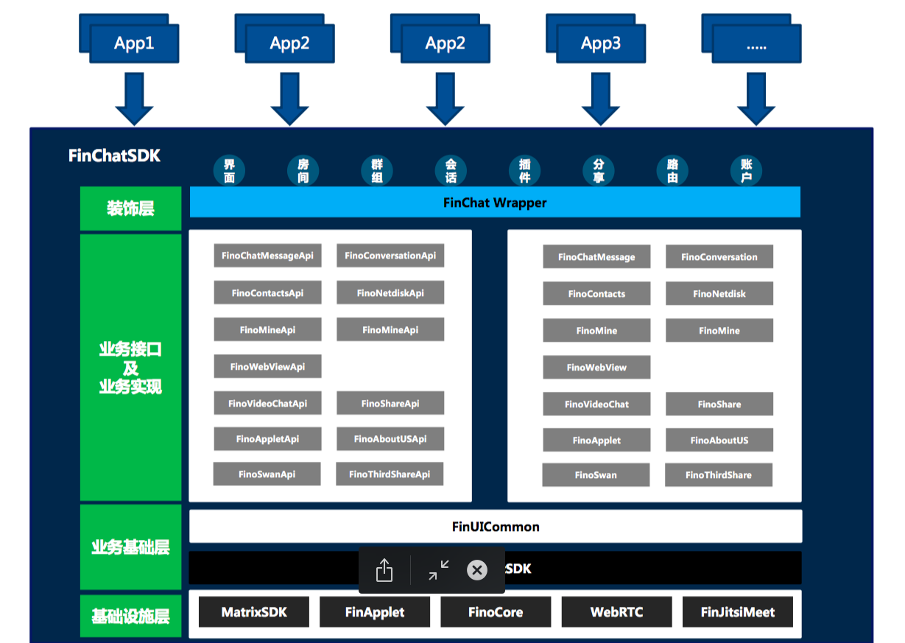

## FinChat SDK iOS端的集成文档

#### 1. FinChat SDK 简介

FinoChat SDK 为用户开发 IM 相关的应用提供的一套完善的开发框架。包括以下几个部分：


- SDK_Core: 核心的消息协议实现，完成与服务器之间的信息交换。
- SDK: 基于核心协议实现的完整的 IM 功能，实现了不同类型消息的收发、会话管理、群组、好友、聊天室等功能。
- HttpEngine: H5资源加速服务组件
- ConvoUI: 会话型UI交互组件
- FinoChatClient: 是 SDK 的入口，主要完成初始化等功能,也是获取其他模块的入口。
    - AccountApi: 负责账户管理相关功能，包括登入、登出等。
    - ContacApi: 负责好友的添加删除，黑名单的管理。
    - GroupApi: 负责群组的管理，创建、删除群组，管理群组成员等功能。
    - ChatRoomApi: 负责聊天室的管理。
    - UIApi: 是一组 IM 相关的 UI 控件，旨在帮助开发者快速集成FinoChat SDK。
    - ChatUI: 消息聊天界面UI
    - ConversationUI: 会话列表UI
    - MineUI: “我”的信息UI
    - ContactUI: 通讯录UI

#### 2. 集成前的准备工作

**注册凡泰开发者账号**

首先，去[凡泰官网](https://www.finogeeks.com/) (https://www.finogeeks.com/) 注册开发者账号，并登录到凡泰[Git](https://git.finogeeks.com/) (https://git.finogeeks.com/) 中。

如果，您仅仅想试用一下，那也可以使用[Demo](https://git.finogeeks.com/finchat/finchat-ios-demo) (https://git.finogeeks.com/finchat/finchat-ios-demo) 来体验。
按照 Demo 中的readme来操作，就可以很轻松将Demo运行起来。

FinChat SDK目前是通过cocopods的形式集成，所以客户需要先注册凡泰开发者账号。
然后，相关对接人会给该账号配置仓库权限，客户将FinChatSDK对应的source添加到podfile中，添加FinChat 依赖即可。

**申请appKey**

另外，FinChat SDK在初始化时，需要配置appKey，该appKey是与bundleId以及客户的后台服务器关联的，所以需要客户提供bundleId和服务器地址，然后再生成appKey。

这里直接联系凡泰相关对接人员，他们会帮助你生成appKey。

#### 3. 集成FinChat SDK
目前FinChat SDK 仅提供了Cocoapods的方式集成。
首先，在Podfile中配置资源仓库地址：

```
source 'https://git.finogeeks.com/cocoapods/finogeeks'
source 'https://github.com/CocoaPods/Specs.git'
```

然后，添加依赖：

```
pod 'FinChat-Mixins'
```

如果对Cocoapods不太熟悉的话，可以在项目根目录下创建一个Podfile文件，然后将如下内容拷贝到Podfile中。

```
platform :ios, "9.0"
source 'https://git.finogeeks.com/cocoapods/finogeeks'
source 'https://github.com/CocoaPods/Specs.git'
inhibit_all_warnings!
def podFrameWork
    pod 'FinChat-Mixins'
end
target "FinChat" do 
    podFrameWork
end
post_install do |installer|
  installer.pods_project.targets.each do |target|
    target.build_configurations.each do |config|
            config.build_settings['ENABLE_STRICT_OBJC_MSGSEND'] = 'NO'
            config.build_settings['APPLICATION_EXTENSION_API_ONLY'] = 'NO'
    end
  end
end
```

> 注意：这里target 后面的 `FinChat`是你的工程target名字，你需要将其修改为你的工程的target名字。

#### 4. 安装FinChat SDK
在 Mac 电脑 终端里，进入到podfile 所在的目录，然后执行如下命令：

```
pod install
```

安装完成后，使用`xxxx.xcworkspace`重新打开工程。

#### 5. 修改工程配置

1. Xcode 10以上的版本，需要修改File->Workspace Settings->Build System为：【Legacy Build System】。


2. 在Project->Build Settings->Bitcode 设置为【NO】。


#### 6. FinChat SDK 在iOS端的使用

##### 6.1 SDK初始化

SDK初始化的实例：

```
// 初始化需要的配置参数，后面会详细介绍各种配置参数
NSDictionary *configDict = [self configDict];
FinoChatConfig *config = [[FinoChatConfig alloc] initWithDict:configDict];
FinoChatOptions *options = [FinoChatOptions optionsWithConfig:config];

NSError *error = nil;
// SDK的初始化
BOOL isInit = [[FinoChatClient sharedInstance] fino_initSDK:options error:&error];
```

如果appKey等信息配置正确，且在合法时间内，初始化都是极快的。

关于各种配置项以及其含义，可以去[iOS开关配置](https://docs.finogeeks.club/docs/mobile/#/finchat-config?id=finchat-ios%E7%AB%AF%E5%BC%80%E5%85%B3%E9%85%8D%E7%BD%AE)查看。

##### 6.2 主题设置

目前FinChatSDK 内部内嵌了三种主题样式：凡泰蓝、喜庆红、深蓝，如果使用这三种主题样式的话，可以使用如下API来设置。

```
// 设置主题色
[FINThemeManager setThemeType:FINThemeType_Blue];
```

如果，您需要自定义主题样式的话，需要使用我们提供的主题模板(theme.plist)，然后将其中颜色修改为您需要的颜色即可。

使用自定义的主题，可以这样来设置：

```
NSString *path = [[NSBundle mainBundle] pathForResource:@"theme" ofType:@"plist"];
[FINThemeManager setThemeTypeWithThemeFilePath:path];
```

在新版本上修改另一种主题时，可以在设置主题之前移除旧主题：

```
[FINThemeManager removeCurrentThemeType];
```

关于主题各个项的含义和控制范围，可以去[主题配置](https://docs.finogeeks.club/docs/mobile/#/finchat-theme-config?id=finchat-ios%E7%AB%AF%E4%B8%BB%E9%A2%98%E9%85%8D%E7%BD%AE)查看。

##### 6.3 FinChatSDK 功能使用

**判断当前是否已登录**

```
BOOL isLogin = [[FinoChatClient sharedInstance].finoAccountManager isLogin]
```

当app启动时，可以根据该api来判断是跳转到登录页还是跳转到主页。

**会话列表页创建**

```
UIViewController *messageVC = [[FinoChatClient sharedInstance].finoChatUIManager conversationViewController];
```

**通讯录列表页创建**

```
UIViewController *contactVC = [[FinoChatClient sharedInstance].finoChatUIManager addressBookControllerWithContactsDelegate:nil contactsDataSource:nil];
```

**工作页创建**

```
UIViewController *workVC = [[FinoChatClient sharedInstance].finoChatUIManager workViewController];
```

**我的页面创建**

```
UIViewController *mineVC = [[FinoChatClient sharedInstance].finoChatUIManager mineViewControllerWithList:list callback:^(NSString *cellMark) {
    NSLog(@"你点击了%@", cellMark);
}];
```

> 注意：FinChat SDK中的部分接口需要在登录条件下才可调用，所以api内部会校验appKey的有效性，以及当前是否已登录，如果未登录则会返回nil。


**登录功能**

登录其实是有多种方式，比如使用账号和密码登录。

```
[[FinoChatClient sharedInstance].finoAccountManager login:userName password:password success:^(NSDictionary* ret) {
        
} failure:^(NSError *error) {
        
}];
```

使用token登录

```
[[FinoChatClient sharedInstance].finoAccountManager loginWithToken:token success:^(NSDictionary *result) {
        
} failure:^(NSError *error) {
        
}];
```

使用手机号和验证码登录

```
[[FinoChatClient sharedInstance].finoAccountManager loginWithMobile:mobile verification:code success:^(NSDictionary *result) {
        
} failure:^(NSError *error) {
        
}];
```

其他，更详尽的API介绍，可以参考[这里]() 或者 [SDK文档](https://api.finogeeks.club/docs/ios/annotated.html)


## 架构介绍



FinChat SDK使用组件化的架构，充分解耦了各个模块。集成时可以根据需求选择一些可选模块，比如音视频模块。
sdk架构主要分三层，基础设施层包括matrixsdk负责底层即时通讯，FinApplet为小程序运行时，sdkcore负责权限校验。业务基础层主要为FinChatSDK，负责sdk内部的基础业务逻辑。业务层主要就是各个模块的组件，实现了上层的业务功能。

#### 模块介绍

- MatrixSDK

基础通讯模块，包含底层的即时通讯功能

- FinChatSDK

sdk的基础模块，包含公共的工具库和资源，以及一些基础的功能

-FinUICommon

sdk公共UI的基础模块，包含常用的toast,alert,sheet,图片查看器等

- FinoChatMessage

聊天模块，包含房间的创建，详情，消息搜索，聊天页面等功能

- FinoConversation

会话模块，主要包含会话列表相关功能

- FinoAddressBook

通讯录模块，主要包含通讯录，好友详情，搜索模块，包含全局搜索等

- FinoNetDisk

网盘模块，包含网盘的展示，搜索，文件转发等功能

- FinoWork

工作模块，包含任务，通知, 工作圈，待办等功能

- FinoShare

苹果系统分享相关功能

- FinoVideoChat

音视频模块，包含音视频通话相关功能

- FinoApplet

小程序应用、机器人应用、网页应用展示与搜索相关功能

- FinoWebView

H5浏览器、Native与H5相关的js交互相关功能

- FinThirdPShare

包含外部分享，第三方分享相关功能

- FinoMine

我的帐户资料设置相关功能

- FinoAboutUS

关于我们相关功能

- FinoCallDirectory

苹果系统电话相关功能

#### 源码集成

FinChatSDK的基本集成方式为提供统一的sdk开发包，开发者以sdk提供的接口为基础构建应用。FinChatSDK提供了众多UI层的开放接口，但是如果sdk提供的默认UI不满足需求时，FinChatSDK还支持以源码的方式集成sdk。

通过源码集成时开发者可以修改sdk内部的实现逻辑，从而实现复杂的定制功能。源码集成需要首先获得商务上的授权，然后凡泰会提供指定模块的源码给集成方。并不是所有的源码都是开放的，finchat只提供了一些组件层的源码，一些底层源码没有开放。

在拿到源码后，开发者可以方便的集成到自己的工程中。因为sdk使用组件化的架构，开发者一般不需要集成所有的源码。而只需要集成自己需要修改的模块。


### sdk主要api接口

sdk的主要入口为[FinoChatClient](https://doc.finogeeks.com/ios/interface_fino_chat_client.html)

可以通过 `FinoChatClient` 获取到sdk大部分开放的接口，例如 `[[FinoChatClient sharedInstance].finoAccountManager isLogin]`

#### finoAccountManager()
账户管理相关api

#### finoChatUIManager()
界面管理相关api

#### finoChatRoomManager()
房间管理相关api

#### finoSwanUIManager()
财富通界面UI相关API

#### finoContactManager()
SDK通讯录（关系链）相关API

#### finoMineManager()
SDK我的帐户相关API

#### finoEventManager()
SDK事件处理相关API

#### finoShareManager()
SDK系统分享处理相关API

#### finoPluginManager()
插件功能相关api

#### finoRouterManager()
SDK路由管理相关API

#### finoWebViewManager()
SDKWebView管理相关API

#### finoAppletManager()
SDK小程序管理相关API

#### finoThirdPShareManager()
SDK第三方分享管理相关API

#### finoWorkManager()
SDK工作管理相关API

#### eventDelegate
聊天室消息事件代理

#### roomSettingDelegate
房间设置自定义项代理

#### userDetailDelegate
个人详情自定义菜单代理

### 帐户管理

账户管理接口为 [IFinoAccountManager](https://doc.finogeeks.com/ios/protocol_i_fino_account_manager-p.html)

#### 用户登录

``` objc
- (void)login:(NSString *)username
password:(NSString *)password
 success:(void (^)(NSDictionary *result))success
 failure:(void (^)(NSError *error))failure;
```
参数介绍
- username 用户名
- password 密码

示例：
```
[[FinoChatClient sharedInstance].finoAccountManager login:userName password:password success:^(NSDictionary* ret) {
    [[NSUserDefaults standardUserDefaults] setObject:userName forKey:kFINLoginAccount];
    [FCHUD dismiss];
    if (weakSelf.isFromAuth) {
        NSString *userId = [FINServiceFactory sharedInstance].currentUserId;
        
        NSString *urlStr = [NSString stringWithFormat:@"%@:%@", weakSelf.reDirectUrl, userId];
        [[UIApplication sharedApplication] openURL:[NSURL URLWithString:urlStr]];
    }
    [[NSNotificationCenter defaultCenter] postNotificationName:kFinoChatLoginSuccessNotification object:nil];
} failure:^(NSError *error) {
    [FCHUD showTipsWithMessage:error.localizedDescription];
}]
```
#### token登录

sdk支持使用token登录，token由后端生成
```
- (void)loginWithToken:(NSString *)token
success:(void (^)(NSDictionary *result))success
failure:(void (^)(NSError *error))failure;
```
示例：
```
[[FINServiceFactory sharedInstance].accountManager loginWithToken:token success:^(NSDictionary *response) {
    [[NSNotificationCenter defaultCenter] postNotificationName:kFinoChatLoginSuccessNotification object:nil];
} failure:^(NSError *error) {
    [FCHUD showErrorWithMessage:error.localizedDescription];
}]
```
#### 判断是否登录

    - (BOOL)isLogin;

示例：

```objc
if ([[FinoChatClient sharedInstance].finoAccountManager isLogin]){
    self.window.rootViewController = [[FINMainController alloc] init];
    //如果userInfo 有内容说明是点击通知打开的应用,如果没有内容则是点击icon打开的应用
} else {
    FCLoginViewController *loginvc = [[FCLoginViewController alloc] init];
    FCNavigationController *navVC = [[FCNavigationController alloc] initWithRootViewController:loginvc];
    [UIApplication sharedApplication].applicationIconBadgeNumber = 0;
    
    [self.window setRootViewController:navVC];
}
```

#### 退出登录

    - (void)logout;

示例：

```objc
[[FinoChatClient sharedInstance].finoAccountManager logout];
```

#### 缓存管理

- 获取sdk缓存大小
```
- (NSUInteger)cacheSize;
```

其中回调结果为sdk内缓存数据的大小，单位byte

示例：

```objc
NSUinteger size = [[FinoChatClient sharedInstance].finoAccountManager cacheSize];
```
- 清理缓存

```
- (void)cleanCache;
```

示例：

```objc
[[FinoChatClient sharedInstance].finoAccountManager cleanCache];
```

### 界面管理

界面相关接口为[IFinoChatUIManager](https://doc.finogeeks.com/ios/protocol_i_fino_chat_u_i_manager-p.html)

#### 获取会话列表

```
- (UIViewController *) conversationViewController    
```
示例：

```objc
UIViewController *messageVC = [[FinoChatClient sharedInstance].finoChatUIManager conversationViewController];
```

#### 获取通讯录列表界面

```
- (UIViewController *)addressBookControllerWithContactsDelegate:(id<IFINContactsDelegate>)contactsDelegate contactsDataSource:(id<IFINContactsDataSource>)contactsDataSource;
```
示例：

```objc
UIViewController *contactVC = [[FinoChatClient sharedInstance].finoChatUIManager addressBookControllerWithContactsDelegate:nil contactsDataSource:nil];
```

#### 频道列表界面

```
- (UIViewController *) channelListViewController    
```
示例：

```objc
UIViewController *channelVC = [[FinoChatClient sharedInstance].finoChatUIManager channelListViewController];
```

#### 工作界面

```
- (UIViewController *)workViewController;
```
示例：

```objc
UIViewController *workVC = [[FinoChatClient sharedInstance].finoChatUIManager workViewController];
```
#### 获取个人信息页面

```
- (UIViewController *)mineViewControllerWithList:(NSArray *)list callback:(void(^)(NSString *))callback;
```
示例：

```objc
NSArray *list = @[
                    @[@{@"cellMark": @"kFINMineUerInfoCellMark"}],
                    @[@{@"cellMark": @"kFINMineSetCustZoneCellMark"}],
                    @[@{@"cellMark": @"kFINMineSetCellMark"}]
                ];
UIViewController *mineVC = [[FinoChatClient sharedInstance].finoChatUIManager mineViewControllerWithList:list callback:nil];
```

#### 创建一个webview页面

```
- (UIViewController *)webViewWithURL:(NSDictionary*)options;
```
示例：

```objc
NSString *baseURL = [FINServiceFactory sharedInstance].sessionManager.options.config.finochatApiURL;
NSURL *url = [NSURL URLWithString:[NSString stringWithFormat:@"%@/statics/agreement/index.html", baseURL]];
if (!url) {
    return ;
}
UIViewController *webVC = [[FinoChatClient sharedInstance].finoChatUIManager webViewWithURL:@{@"url": url,@"source": @(6),}];
[self.navigationController pushViewController:webVC animated:YES];
```

### 聊天房间及消息管理
聊天室相关接口为[IFinoChatRoomManager](https://doc.finogeeks.com/ios/protocol_i_fino_chat_room_manager-p.html)

#### 创建群聊房间

```
/**
 创建房间（带完成回调）
 
 @param userIds 选中的人的数组 @[user1Id,user2Id....]
 */
- (UIViewController *)createRoomViewController:(NSDictionary *)param
                                                 completeBlock:(void(^)(NSString *roomId, NSError *error))createRoomDoneBlock;
```
参数介绍
- param 如：@{@"userIds":@[@"a",@"b"]}

示例：
```
NSDictionary *param = @{@"userIds":@[@"abc",@"def"]};
[[FinoChatClient sharedInstance].finoChatRoomManager createRoomViewController:param completeBlock:^(NSString *roomId, NSError *error) {
    NSLog(@"room create");
}];
```

#### 有未读消息的房间数

```
- (NSInteger)missedDiscussionsCount;
```
示例：
```
NSUInteger count = [[FinoChatClient sharedInstance].finoChatRoomManager missedDiscussionsCount];
```

#### 有未读消息的消息数

```
- (NSInteger)missedNotificationsCount;
```
示例：
```
NSUInteger count = [[[FinoChatClient sharedInstance] finoChatRoomManager] missedNotificationsCount];
```

#### fan通知消息的未读数量

```
- (NSInteger)fanMessageUnReadCount;
```
示例：
```
NSUInteger count = [[[FinoChatClient sharedInstance] finoChatRoomManager] fanMessageUnReadCount];
```

#### 任务消息的未读数量

```
- (NSInteger)taskMessageUnReadCount;
```
示例：
```
NSUInteger count = [[[FinoChatClient sharedInstance] finoChatRoomManager] taskMessageUnReadCount];
```

#### 添加好友

```
- (UIViewController* )addFriend;
```
示例：
```
UIViewController *vc = [[[FinoChatClient sharedInstance] finoChatRoomManager] addFriend];
```

#### 滑动到未读处

```
- (void)scrollToUnreadRoom;
```
示例：
```
[[[FinoChatClient sharedInstance] finoChatRoomManager] scrollToUnreadRoom];
```

#### 获取会话列表数据

```
- (void)getConversationList:(void (^)(NSArray *conversationList))success
failure:(void (^)(NSError *error))failure;
```
示例：
```
[[FinoChatClient sharedInstance].finoChatRoomManager getConversationList:^(NSArray *conversationList) {
    
} failure:^(NSError *error) {
    
}];
```

#### 发送文本消息

```
- (void)sendTextMessage:(NSString*)roomId
message: (NSString*) message
success:(void (^)(NSString *eventId))success
failure:(void (^)(NSError *error))failure;
```
#### 发送图片消息

```
- (void)sendImageMessage:(NSString*)roomId
  image: (UIImage*) image
success:(void (^)(NSString *eventId))success
failure:(void (^)(NSError *error))failure;
```

#### 发送视频消息

```
- (void)sendVideoMessage:(NSString*)roomId
videoLocalURL: (NSURL*) videoLocalURL
withThumbnail: (UIImage *)videoThumbnail
      success:(void (^)(NSString *eventId))success
      failure:(void (^)(NSError *error))failure;
```

#### 发送语音消息

```
- (void)sendAudioMessage:(NSString*)roomId
    duration:(CGFloat)duration
fileLocalURL:(NSURL*) fileLocalURL
     success:(void (^)(NSString *eventId))success
     failure:(void (^)(NSError *error))failure;
```

#### 发送文件消息

```
- (void)sendFileMessage:(NSString*)roomId
fileLocalURL: (NSURL*) fileLocalURL
    mimeType: (NSString*)mimeType
      success:(void (^)(NSString *eventId))success
      failure:(void (^)(NSError *error))failure;
```

#### 发送URL消息

```
/*!
 * @brief 发送URL消息
 * @param roomId 房间ID
 * @param content 消息内容
 { \n
 "url": "",// URL地址\n
 "title": "",//标题\n
 "description": "",//描述\n
 "domain": "",//域(可选，传空串)\n
 "imageURL": "",//图片地址\n
 "proto": ""//协议(http,https)\n
 }\n
 * @param success 成功回调
 * @param failure 失败回调
 *
 */
- (void)sendURLMessage:(NSString*)roomId
               content: (NSDictionary*)content
                success:(void (^)(NSString *eventId))success
                failure:(void (^)(NSError *error))failure;
```

#### 发送自定义消息

```
/**
 发送自定义消息

 @param roomId 房间Id
 @param content 消息内容字典
 @param type 消息类型
 @param success 发送成功的回调
 @param failure 发送失败的回调
 */
- (void)sendCustomMessageToRoom:(NSString *)roomId
                        content:(NSDictionary *)content
                           type:(NSString *)type
                        success:(void (^)(NSString *eventId))success
                        failure:(void (^)(NSError *error))failure;
```

#### 外部接收自定义消息

```
- (void)roomDidReceiveCustomMessagBlock:(NSDictionary *(^)(NSString *roomId,NSString *sender, NSDictionary *content))receive;
```

#### 从后台获取某个房间id到本地

```
- (void)syncRoomWithRoomId:(NSString *)roomId completion:(void(^)(NSString *roomId))completion;
```

### 聊天室消息自定义事件处理

```
/**
 控制event是否显示的代理方法
 如果该代理方法返回FinoChatShowTypeShow，则必须实现-displayTextInConversationList：和 -customEventViewWithEvent：

 @param event event
 @return FinoChatShowType
 */
- (FinoChatShowType)shouldShowInConversationList:(MXEvent *)event;

/**
 自定义消息在会话列表中显示的内容

 @param event 消息
 @return 显示的内容
 */
- (NSString *)displayTextInConversationList:(MXEvent *)event;

/**
 自定义消息在聊天室中显示的视图

 @param event 自定义消息事件
 @return 显示的效果视图
 */
- (UIView *)customEventViewWithEvent:(MXEvent *)event;

/**
 自定义的事件类型

 @return 数组
 */
- (NSArray *)customEventTypes;

/**
 是否要自定义点击事件

 @param event 事件
 @param roomId 房间Id
 @return BOOL值，返回YES，则不会走原有逻辑，返回NO，则会走原有逻辑
 */
- (BOOL)customClickEvent:(MXEvent *)event inRoom:(NSString *)roomId;

/**
 消息上的Menu菜单是否显示

 @param event 事件
 @param action 菜单事件
 @return 显示类型FinoChatShowType
 */
- (FinoChatShowType)shouldShowEventMenuOnEvent:(MXEvent *)event action:(SEL)action;


/**
 是否要自定义消息长按菜单的点击事件

 @param event 事件
 @param roomId 房间ID
 @param action 菜单事件
 @return BOOL值，返回YES,则不会走原有逻辑，返回NO，则会走原有逻辑
 */
- (BOOL)customEventMenuClickEvent:(MXEvent *)event inRoom:(NSString *)roomId action:(SEL)action;

```
### 房间设置自定义项代理

代理相关接口为[FinoRoomSettingDelegate]
```
- (NSArray *)customActionTitlesForRoomSetting;

- (void)customActionDidClick:(NSString *)actionTitle inViewController:(UIViewController *)viewController userInfo:(NSDictionary *)userInfo;

```

### 通讯录个人详情自定义菜单代理

代理相关接口为[FinoUserDetailMenuDelegate]
```
- (NSArray *)customMenuTitlesForUserDetail;

- (void)customMenuDidClick:(NSString *)menuTitle inViewController:(UIViewController *)viewController userInfo:(NSDictionary *)userInfo;
```

### 通讯录
通讯录（关系链）相关API[IFinoContactManager](https://doc.finogeeks.com/ios/protocol_i_fino_contact_manager-p.html)

#### 查找联系人
```
/*!
 * @brief 查找联系人
 * @param name 昵称、手机号、用户ID
 */
- (void)searchContact:(NSString*)name;
```

#### 主动刷新通讯录数据
```
- (void)reloadContactData;
```

#### 通过userId添加好友

```
/*!
 * @brief 通过userId添加好友
 * @param userId 被添加好友的id
 * @param remark 被添加好友的昵称
 * @param completion 添加完成的回调
 */
- (void)addFriendWithUserId:(NSString *)userId
                     remark:(NSString *)remark
                 completion:(void(^)(NSDictionary *result, NSError *error))completion;
```

#### 同意好友的添加邀请
```
/*!
 * @brief 同意好友的添加邀请
 * @param userId 添加的人的id
 * @param roomId 房间id
 * @param remark 添加好友的昵称
 * @param completion 添加完成的回调
 */
- (void)acceptFriendInviteWithUserId:(NSString *)userId
                              roomId:(NSString *)roomId
                              remark:(NSString *)remark
                          completion:(void(^)(NSDictionary *result, NSError *error))completion;
```

#### 拒绝好友的添加邀请

```
/*!
 * @brief 拒绝好友的添加邀请
 * @param userId 添加的人的id
 * @param roomId 房间id
 * @param remark 添加好友的昵称
 * @param completion 添加完成的回调
 */
- (void)rejectFriendInviteWithUserId:(NSString *)userId
                              roomId:(NSString *)roomId
                              remark:(NSString *)remark
                          completion:(void(^)(NSDictionary *result, NSError *error))completion;
```

#### 转发单个文件

```
/*!
 * @brief 转发单个文件
 * @param fileData 转发文件的Data数据
 * @param fileName 转发的文件名称
 * @param fileType 转发的文件类型（可选字段,默认是 m.file） fileType ：m.image/m.audio/m.video/m.file
 * @param completeBlock 转发完成的回调 error==nil 表示成功 resouceId资源id
 */
- (void)forwardFileWithFileData:(NSData *)fileData fileName:(NSString *)fileName fileType:(NSString *)fileType completeBlock:(void(^)(NSError *error,NSString *resouceId))completeBlock;
```

#### 转发多个个文件

```
/*!
 * @brief 转发多个个文件
 * @param filesArray 转发文件数据源
 * eg {
    @"fileData":fileData,
    @"fileName":fileName,
    @"fileType":fileType,// m.image/m.audio/m.video/m.file
    }
 * @param completeBlock 转发完成的回调 error==nil 表示成功 resouceIds资源id
 */
- (void)forwardFilesWithFilesArray:(NSArray<NSDictionary *> *)filesArray completeBlock:(void(^)(NSError *error,NSArray *resouceIds))completeBlock;
```

#### 多消息内容分享到聊天的方法 该方法不需要push或者是present 直接调用即可

```
/**
 * @brief 多消息内容分享到聊天的方法 该方法不需要push或者是present 直接调用即可
 * @param superViewController 当前的控制器
 * @param messageArray 转发的消息体数组
 eg.
 @[{
    body = "百度一下";
    info =     {
         description = "";
         domain = "www.baidu.com";
         image = "";
         proto = https;
         title = "百度一下";
         url = "https://www.baidu.com/";
    };
    msgtype = "m.url";
 }]
 * @param completeBlock 转发完成的回调
 * successRoomIdArrray 转发成功的房间id数组
 * failureRoomIdArrray 转发失败的房间id数组
 * @return 返回转发控制器
 */
- (UIViewController *)shareMessageInViewController:(UIViewController *)superViewController messageArray:(NSArray *)messageArray completeBlock:(void(^)(NSArray *successRoomIdArrray,NSArray *failureRoomIdArrray,NSArray *successResouceIds))completeBlock;
```


### sdk主要业务服务接口

sdk的业务服务接口为[FINServiceFactory](https://doc.finogeeks.com/ios/interface_f_i_n_service_factory.html)

可以通过 `FINServiceFactory` 获取到sdk大部分开放的接口，例如 `[FINServiceFactory sharedInstance].currentUserId`

当前有效session
```
@property (nonatomic, strong, readonly) MXSession *currentSession;
```
当前用户的fcId
```
@property (nonatomic, copy, readonly) NSString *currentUserId;
```
当前账号
```
@property (nonatomic, strong, readonly) FINAccount *currentAccount;
```


## 参考手册

[ios apidoc](https://doc.finogeeks.com/ios/)

## 示例代码

[ios demo 工程](https://git.finogeeks.com/finchat/finchat-ios-demo)

## 常见问题

待更新

