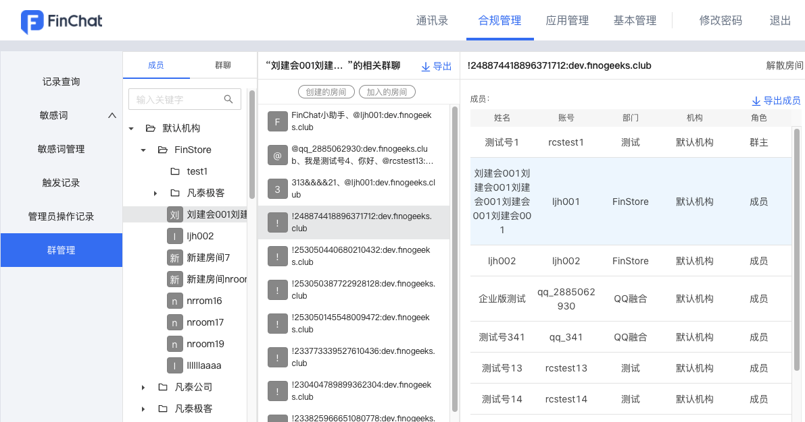

# 管理后台操作手册
## 1.通讯录
* 菜单入口：点击管理后台顶部的【通讯录】

### 1.1 通讯录展示
* 左侧树结构：可按照组织架构或角色查看，可添加角色、角色组
* 右侧列表：展示成员基本信息（姓名、职级、部门、手机号、邮箱、状态），最右列操作栏依次为【置顶】、【编辑】与【停用】操作；点击【置顶】后该账号置顶，再次点击即取消置顶；点击【编辑】，弹出成员信息弹窗，编辑后点击【保存】即完成修改；点击【停用】后该账号无法登陆客户端，处于停用状态，再次点击即可恢复正常状态，可登陆客户端

### 1.2 搜索功能
* 可在组织架构下搜索姓名、账号与手机号
* 点击搜索结果，弹出成员信息弹窗，供查看与编辑

### 1.3 其他功能
* 编辑部门：点击任意部门，可对部门进行【添加子部门】、【编辑部门】、【上移】、【下移】和【删除】操作

* 切换手动排序：点击【切换手动排序】，弹出确认弹窗，点击【确认】后，在列表最右列增加【上移】与【下移】功能，以此控制所有设备通讯录的排序；再次点击即可切回自动排序

* 操作离职：点击【操作离职】，弹出复问弹窗，点击【确认】后，该账号为已离职状态，不可登录，不可再次编辑，且该账号占用，不可再次被使用

* 批量导入：点击【批量导入】，进入批量导入页面，提供导入模板，可拖拽文件至上传区域或点击【上传文件】来完成上传

* 批量导出：点击【批量导出】，弹出复问弹窗，点击【确认】后，即可导出

* 新增成员：点击【新增成员】，弹出新增成员弹窗，带红色星标的内容为必填项，点击【保存】即可新增

## 2.数据统计
* 为帮助管理员更好地推广和运营FinChat在机构内的使用，管理员可以通过【数据统计】从多种角度了解用户的使用情况
* 本功能中包含的全部指标及统计方式说明如下：

### 2.1 用户统计
* 通过用户统计，管理员可以从人数角度了解FinChat的使用情况
* 菜单入口：点击管理后台顶部的【数据统计】>> 左侧导航区域打开【用户统计】

#### 2.1.1 用户数据概览
* 展示当日的用户活跃人数，和截止当日系统内的全部用户（账号）数

#### 2.1.2 活跃用户统计
* 展示某一时间段内活跃用户的数量
* 当鼠标附着在折线图上时，可以查看具体某天的活跃用户数量

### 2.2 版本统计
* 通过版本统计，管理员可以从平台和版本角度了解使用情况
* 菜单入口：点击管理后台顶部的【数据统计】>> 左侧导航区域打开【版本统计】
* 根据查询的日期，展示当日Windows、Mac、Android和iOS四个平台不同版本的使用人数和占比，且最多展示前top5的版本

### 2.3 消息统计
* 通过消息统计，管理员可以从发消息的房间类型、消息类型、发送时间角度了解使用情况
* 菜单入口：点击管理后台顶部的【数据统计】>> 左侧导航区域打开【消息统计】

#### 2.3.1 房间使用情况
* 展示某一时间段内产生消息的不同类型的房间数量
* 当鼠标附着在柱状图上时，可以查看具体类型房间的数量；点击柱状图下方的房间类型，可以筛选查看某几个房间类型的具体情况

#### 2.3.2 消息类型情况
* 展示某一时间段内不同消息类型的发送数量
* 当鼠标附着在柱状图上时，可以查看具体类型消息的数量；点击柱状图下方的消息类型，可以筛选查看某几个消息类型的具体情况

#### 2.3.3 发消息数时段图-指定日期
* 展示指定日期的不同时间点的发消息数量
* 当鼠标附着在折线图上时，可以查看具体的发消息数量

#### 2.3.4 发消息数分日汇总-近七日
* 展示近七日的不同时段下发消息的数量和占比情况

## 3.合规管理
### 3.1 记录查询
* 为符合金融行业的合规要求，可对消息记录进行留痕和查询
* 菜单入口：点击管理后台顶部的【合规管理】>> 左侧导航区域打开【查询记录】
* 可以通过两种方式进行查询：1.通过筛选关键词/发送人/发送时间，从全局查询相关房间；再选择某个房间后，可查看相关的消息  2.通过选择【成员】或者【群聊】筛选聊天房间；再选择某个房间后，可以按照关键词/发送人/发送时间进一步筛选和搜索
* 点击右上角【导出记录】按钮，可导出对应房间的消息记录

### 3.2 敏感词
* 为符合金融行业的合规要求，可对聊天消息中的敏感词及其拼音形态进行监控和屏蔽
* 菜单入口：点击管理后台顶部的【合规管理】>> 左侧导航区域打开【敏感词】

#### 3.2.1 敏感词管理
* 点击右上角【新增】按钮，打开新增敏感词的弹窗
* 触发处置分为“禁止发送”和“仅留痕”两种类型，如果消息中包含“禁止发送”类型的词语，将会以“* *”的形式替换该词语，如果消息中包含“仅留痕”类型的词语，则仅将该消息进行记录 

#### 3.2.2 触发记录
* 可按照发送时间、发送人账号、敏感词和触发处置查询触发记录
* 点击右上角【导出记录】按钮，可导出触发记录

### 3.3 管理员操作记录
* 查看管理员在某个时间对某个对象做的具体操作，使管理员的操作可追溯，支持按照管理员、日期来筛选
* 导出记录：点击【导出记录】，可导出所筛选的管理员操作记录
* 菜单入口：点击管理后台顶部的【合规管理】>> 左侧导航区域打开【管理员操作记录】

### 3.4 群管理
* 对群聊进行管理，查看所有群聊并查看其群成员，或解散群聊
* 菜单入口：点击管理后台顶部的【合规管理】>> 左侧导航区域打开【群管理】

#### 3.4.1 群聊查询
* 选择【成员】查看其相关群聊，支持筛选加入的或创建的，点击【导出】导出该成员的所有群聊，点击任一群聊查看群聊信息如群成员等，点击【导出成员】导出具体成员列表
* 或者选择群聊，查看群聊信息如群成员等，点击【导出成员】导出具体成员列表

#### 3.4.2 解散房间
* 点击群聊信息右上角的【解散房间】，弹出确认弹窗

* 点击【确认】后，即可解散指定房间；

### 3.5 举报投诉
* 可查看用户有关违法违规行为和消息的举报投诉记录
* 菜单入口：点击管理后台顶部的【合规管理】>> 左侧导航区域打开【举报投诉】

### 3.6 反馈建议
* 可查看用户有关产品的问题反馈和使用建议的记录
* 菜单入口：点击管理后台顶部的【合规管理】>> 左侧导航区域打开【反馈建议】

## 4.应用管理
* 为从用户使用角度提升应用的安全和合规性，管理员可以指定哪些用户可以使用哪些应用，只有可用范围内的用户才见应用的入口，才可与应用进行交互
* 点击某个应用右侧的【配置】按钮打开弹窗，可设置全部成员可用或部分成员可用

## 5.基本管理
### 5.1 版本管理
* 管理员可通过后台的【版本管理】，自主维护客户端的更新服务。若客户端检测到当前的版本低于通过管理后台所上传的最新版本，系统将给对应的客户端推送版本升级提示，提醒用户更新
* 菜单入口：点击管理后台顶部的【基本管理】>> 左侧导航区域打开【版本管理】

#### 5.1.1 桌面端
* 从左侧导航栏选中桌面端，按照不同的操作系统Mac/Windows上传FinChat桌面端的zip包即可

* 上传成功后，使用低版本的用户将会收到版本更新的提示，如下所示

#### 5.1.2 移动端
* 从左侧导航栏选中移动端，选择不同系统或应用市场进行更新
* 输入新版本的下载地址、版本号、推荐用户升级的相关描述后，点击【提交更新】即可；此外，还提供“是否要求强制更新”的选项，勾选后，用户必须选择更新才能继续使用

* 提交更新后，使用低版本的用户将会收到版本更新的提示，如下所示

     
     
### 5.2 安全管理  
* 为保障安全性，设置三个子菜单，【权限设置】控制不同角色的用户在管理后台可见的菜单和可管理的部门或应用；【水印设置】控制客户端通讯录与个人名片是否显示水印，保障组织安全；【名片设置】控制员工对外部联系人展示的信息
* 菜单入口：点击管理后台顶部的【基本管理】>> 左侧导航区域打开【安全管理】

#### 5.2.1 权限设置
* 新增子管理员：点击【新增】打开弹窗，在弹窗中输入子管理员的名称，并设置相应的页面权限和管理范围；点击子管理员右侧的【┆】按钮打开菜单，可进行编辑和删除子管理员

* 添加成员：选中某一管理员后，点击右上方的【添加成员】打开的成员选择弹窗，在弹窗中勾选成员；点击成员列表右侧的【删除】按钮，可删除已选择的成员

#### 5.2.2 水印设置
* 点击打开水印时，客户端的通讯录和个人名片显示水印，关闭水印时则不显示水印

#### 5.2.3 名片设置
* 控制员工对外部联系人展示的信息，包括姓名、手机、座机、邮箱、部门、职级与工号
* 点击【编辑】，勾选或取消勾选各个信息，点击【确认】，即可完成编辑；

### 5.3 通讯录授权
* 如果当前通讯节点能够与其他节点互联互通，那么通过授权通讯录给其他节点，其他节点可以看到本节点的通讯录，并无须添加好友即可发起聊天，从而大大提高两个节点间的沟通效率
* 菜单入口：点击管理后台顶部的【基本管理】>> 左侧导航区域打开【通讯录授权】

#### 5.3.1 新增机构
* 点击【新增机构】，弹出新增机构弹窗，下拉框选择机构，点击【确定】，即可授权通讯录

#### 5.3.2 删除机构
* 点击任一机构后的【删除】，弹出复问弹窗，点击【确认】，即可删除对该机构的授权

